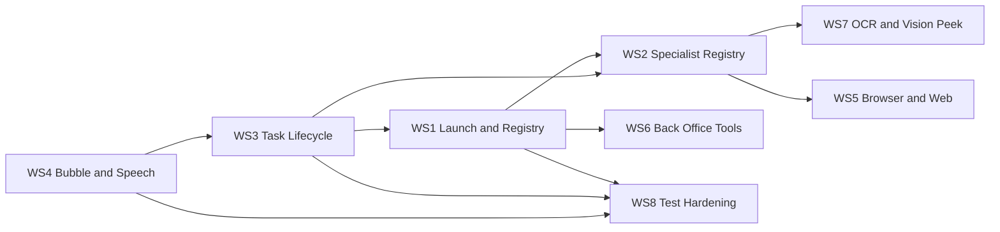

# Phase 2 Implementation Brief

**Date:** 2026-06-22  
**Source:** 67 Phase 1 research lanes in [`INDEX.md`](INDEX.md)  
**Constraint:** Phase 2 runs **8 implementation workstreams** (within 5–10 subagent limit)  
**Goal:** Fix P0 Live trust failures, ship specialist registry foundation, improve launch + back-office reliability

---

## Executive summary

Storm #1 proved the architecture is right (Gemini Live = parent, desktop agent = worker) but **platform guarantees** are missing: sanitized handoffs, honest speech, launch coverage, and declarative specialists. Phase 2 consolidates 67 research lanes into **8 ordered workstreams**. Each workstream has explicit file ownership to prevent overlap.

**Recommended execution order:** WS4 → WS3 → WS1 → WS2 → WS6 → WS7 → WS5 (optional) → WS8 (tests, parallel)

---

## Dependency graph

---

## WS1 — Launch & Registry

**Owner scope:** Universal app open path — registry, resolver, settings URIs, launch specialist, verify hook for launches.

| Item | Detail |
|------|--------|
| **Lanes** | A01, A05 (launch verify), C01–C03, C09, G04 |
| **Files to touch** | `app/tools.py`, new `app/launch.py` (optional), `app/widget/textbox_overlay.py`, `app/widget/gemini_live.py`, `Orynn/agents/launch.md`, `data/launch_registry.json` (optional) |
| **Do NOT touch** | `main.py` task serializer (WS3), bubble mute logic (WS4), `agent.py` ReAct loop (WS6) |

### Acceptance criteria

1. Spoken "open Spotify" resolves via registry **or** `resolve_launch_target` ladder (URI → shell → start).
2. No synthetic `"Server restarted or task was abandoned."` on launch-only goals (depends on WS3 grace).
3. `open_settings(display)` opens correct `ms-settings:` pane.
4. Launch specialist returns `HandoffResult` with `user_message` only to bubble.
5. Post-launch verify checks foreground window title within 2s before Live claims success.
6. `tests/test_fast_path.py` + `tests/test_desktop_launcher.py` cover Spotify + 10 new registry entries.

### Complexity

**L** (resolver ladder is largest chunk)

### Implementation notes

- Start with registry expansion (C01) — unblocks Spotify without full resolver.
- `resolve_launch_target` (C02) is separate commit inside WS1; mock subprocess in tests.
- Wire launch specialist as routing layer in overlay before generic `start_desktop_task`.

---

## WS2 — Live Front Desk & Specialist Registry

**Owner scope:** Declarative specialist platform — registry, routing, mutual exclusion, agent profiles, uia_act + vision_peek contracts.

| Item | Detail |
|------|--------|
| **Lanes** | A02, A03, A08–A14, A17, B04, D09, G02–G03 |
| **Files to touch** | New `app/specialists/{registry,loader}.py`, `Orynn/agents/*.md`, `app/widget/gemini_live.py`, `app/widget/textbox_overlay.py` |
| **Do NOT touch** | `main.py` (WS3), `tools.py` launch ladder (WS1), `agent.py` prompt body (WS6) |

### Acceptance criteria

1. `SpecialistSpec` registry loads at Live connect; generates function declarations.
2. Exclusion groups prevent dual desktop tools per batch (extend beyond current `_DESKTOP_TOOLS`).
3. `uia_act` and `vision_peek` have documented contracts matching storm tool catalog.
4. `Orynn/agents/launch.md`, `uia_act.md`, `vision_peek.md`, `desktop_job.md` ship with frontmatter.
5. Orchestrator hook: after terminal specialist result, optional verify (A17) before Live speaks.
6. `tests/test_specialist_registry.py` + extended `tests/test_gemini_live.py` pass.

### Complexity

**L**

### Implementation notes

- Registry is foundational — land `SpecialistSpec` + loader first, then migrate declarations from hardcoded `_function_declarations`.
- Keep `desktop_control` tool name stable for model compatibility; map internally to `uia_act` specialist.

---

## WS3 — Task Lifecycle & Structured Handoff

**Owner scope:** Backend spawn/poll honesty, payload shape, busy gate, handoff schema — fixes abandon race and task ID contract.

| Item | Detail |
|------|--------|
| **Lanes** | A04, A13, B03, B05, B07, B09, B11 (P2), D05, D08, G06 |
| **Files to touch** | `app/main.py`, `app/widget/textbox_overlay.py`, new `app/models/handoff.py`, `TaskRecord` schema |
| **Do NOT touch** | Bubble sanitizer (WS4), launch registry (WS1), specialist registry loader (WS2) |

### Acceptance criteria

1. `_TASK_START_GRACE` holds fresh tasks as `running`; GET never persists false `failed` during grace.
2. `record.reason` uses honest exception text or `"the task ended before it could run"` — never opaque abandoned string.
3. `HandoffResult` typed schema used by `_capture_live_task_outcome` and all terminal paths.
4. `user_goal` and `prompt_goal` stored separately on `TaskRecord`.
5. `_desktop_busy` clears on terminal, stop, and 30s TTL watchdog.
6. `tests/test_task_abandon_grace.py` covers 0ms poll, exception reason, no abandoned string.

### Complexity

**L** (`main.py` lifecycle is high-risk)

### Implementation notes

- Coordinate with WS4: handoff provides `user_message`; WS4 ensures bubble never sees `debug_reason`.
- Do not merge overlay-only changes into `main.py` without explicit WS3 ownership.

---

## WS4 — Bubble & Speech Sanitization

**Owner scope:** User-facing trust layer — bubble denylist, task outcome muting, reason humanization, proactive `send_task_update`, honest speech timing.

| Item | Detail |
|------|--------|
| **Lanes** | A10, B01, B02, B06, B08, B10, G01, G05 |
| **Files to touch** | `app/widget/textbox_overlay.py`, `app/widget/gemini_live.py`, `app/widget/virtual_cursor.py` |
| **Do NOT touch** | `main.py` serializer (WS3), `tools.py` (WS1/WS6), `agent.py` (WS6) |

### Acceptance criteria

1. No raw `Failed: Server restarted…`, UIA dumps, or JSON in bubble while Live running.
2. `task_result` and `task_*` churn muted under Live (`task_outcome_under_live` in label log).
3. `_sanitize_bubble_text()` denylist applied before every emit.
4. Every terminal task triggers `send_task_update(user_message)` — no silent turns >5s.
5. System prompt forbids success narration until `ok: true` (+ verify when WS1 wired).
6. Golden test replays Spotify label sequence — asserts mute + structured handoff.
7. `ORYNN_LABEL_LOG=1` shows `muted` not `shown` for leaked patterns.

### Complexity

**M**

### Implementation notes

- **Ship first** — unblocks Phase 3 Spotify gate (E03) even before full launch resolver.
- Extends existing fixes documented in storm `reliability/03-bubble-leak-regression.md`.

---

## WS5 — Browser & Web (Optional P1)

**Owner scope:** Browser built-in specialist + web_search reliability.

| Item | Detail |
|------|--------|
| **Lanes** | A06, C06, E01, F06 |
| **Files to touch** | `app/agent.py` (browser profile), `app/widget/gemini_live.py`, `app/widget/textbox_overlay.py`, `tests/test_browser_plugin.py` |
| **Do NOT touch** | UIA tools (WS6), launch (WS1), task lifecycle (WS3) |

### Acceptance criteria

1. Live `browser_task` tool spawns headless browser loop with summary handoff.
2. `web_search` validates non-empty query; failure rate <25% in Phase 3 matrix.
3. SSRF guards preserved (`tests/test_ssrf_guards.py` pass).

### Complexity

**L**

### Defer if

Phase 2 subagent budget tight — P0 is WS3+WS4+WS1.

---

## WS6 — Back Office Tools & Agent

**Owner scope:** Agent prompt hygiene, UIA cache, playbooks, sequence+grid, done validation, electron guard, fuzzy window wait.

| Item | Detail |
|------|--------|
| **Lanes** | D01–D04, D06–D08, C04–C05, C08, B11 (partial) |
| **Files to touch** | `app/agent.py`, `app/tools.py`, `app/adaptive_windows.py`, `app/grid_locate.py` |
| **Do NOT touch** | `gemini_live.py` declarations (WS2), bubble layer (WS4), `main.py` grace (WS3) |

### Acceptance criteria

1. Agent prompt single source of truth — no conflicting LAUNCH vs UIA guidance.
2. UIA cache MVP: hwnd-keyed, 2s TTL, wired to `uia_click` tier-1.
3. Playbooks auto-selected on `observe_window` for Calculator, Notepad.
4. `wait_for_window` fuzzy match passes Spotify title variants.
5. `complete: true` requires verify step or min action count for launch goals.
6. `electron_unlock` deferred when desktop task active.
7. `tests/test_adaptive_windows.py`, `tests/test_grid_locate.py` pass.

### Complexity

**L**

---

## WS7 — OCR Mid-Tier & Vision Peek

**Owner scope:** Live path OCR before vision model; vision_peek specialist hardening.

| Item | Detail |
|------|--------|
| **Lanes** | A03 (peek hardening), C07, E05 |
| **Files to touch** | `app/widget/textbox_overlay.py`, `app/providers.py` |
| **Do NOT touch** | Back-office vision grid (WS6 `grid_locate.py`), specialist registry structure (WS2) |

### Acceptance criteria

1. `look_at_screen` runs OCR pass when text-heavy; skips full describe if confidence high.
2. `frame_age_ms` in tool response for debugging.
3. `scripts/live_vision_smoke.py` scenarios pass in Phase 3.

### Complexity

**M**

### Dependencies

WS2 vision_peek contract should land first (can stub OCR behind flag).

---

## WS8 — Test Hardening (Cross-cutting)

**Owner scope:** Pytest gaps from Phase 1 test matrix — runs parallel to other WS, merges last.

| Item | Detail |
|------|--------|
| **Lanes** | G01–G07, storm `tests/*.txt` inventory |
| **Files to touch** | `tests/test_bubble_sanitizer.py` (new), `tests/test_specialist_registry.py` (new), `tests/fixtures/spotify_label_sequence.jsonl`, extend existing files |
| **Do NOT touch** | Production code except test-only helpers |

### Acceptance criteria

1. All storm offline pytest bundles pass:
   - `pytest tests/test_gemini_live.py`
   - `pytest tests/test_grid_locate.py tests/test_hybrid_resolver.py`
   - `pytest tests/test_adaptive_windows.py tests/test_fast_path.py`
2. New golden + sanitizer tests from G01, G05 land.
3. `tests/07-pytest-coverage-gap-master.md` gaps closed or ticketed.

### Complexity

**M**

---

## What NOT to do (overlap prevention)

| Forbidden overlap | Reason |
|-------------------|--------|
| WS4 editing `main.py` | WS3 owns serializer |
| WS1 editing bubble mute | WS4 owns label arbitration |
| WS2 rewriting `agent.py` prompt | WS6 owns agent prompt |
| WS6 changing Live declarations | WS2 owns registry → declarations |
| WS3 + WS4 both defining handoff schema | WS3 owns `HandoffResult`; WS4 consumes `user_message` only |
| Phase 2 running live Gemini | Phase 3 only |

---

## Phase 3 gate (after Phase 2)

Minimum bar before live testing:

| Gate | Workstream | Live test lane |
|------|------------|----------------|
| Spotify no bubble leak | WS4 + WS1 + WS3 | E03 |
| Calculator e2e | WS6 + WS1 | E04 |
| No silent terminal turns | WS4 | E02, F04 |
| Label log clean | WS4 | E06 |

Run with `ORYNN_LABEL_LOG=1`; bundle `logs/textbox_labels.jsonl`, `tasks/*.json`, debug NDJSON for Phase 4.

---

## Phase 4 forensics split (preview)

| Agent slice | Lane doc |
|-------------|----------|
| Label patterns | F01 |
| Debug NDJSON | F02 |
| Task correlation | F03 |
| Silent turns | F04 |
| Duplicate routing | F05 |
| Web search | F06 |
| Report assembly | F07 |

---

## Lane → workstream quick map

| Lanes | WS |
|-------|-----|
| A01, A05, C01–C03, C09 | WS1 |
| A02–A03, A08–A14, A17, B04, D09 | WS2 |
| A04, A13, B03, B05, B07, B09, D05, D08 | WS3 |
| A10, B01–B02, B06, B08, B10 | WS4 |
| A06, C06 | WS5 |
| D01–D04, D06–D08, C04–C05, C08 | WS6 |
| A03, C07 | WS7 |
| G01–G07 | WS8 |
| E*, F* | Phase 3–4 (not Phase 2 impl) |
| A15–A16, B11 | P2 defer |

---

## Subagent assignment suggestion (8 agents)

| Agent | Workstream | Est. days |
|-------|------------|-----------|
| 1 | WS4 Bubble & Speech | 2–3 |
| 2 | WS3 Task Lifecycle | 3–4 |
| 3 | WS1 Launch & Registry | 4–5 |
| 4 | WS2 Specialist Registry | 4–5 |
| 5 | WS6 Back Office Tools | 4–5 |
| 6 | WS7 OCR & Vision | 2–3 |
| 7 | WS8 Tests | 2–3 (parallel) |
| 8 | WS5 Browser (optional) | 3–4 |

Agents 1–2 should merge before Agent 3 starts heavy launch work. Agent 7 runs continuous integration across PRs.
