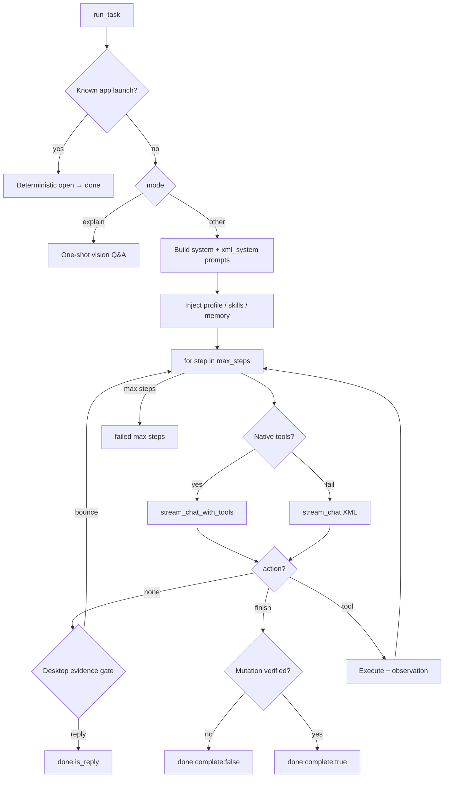

# Agent.py Prompt & Loop Review

**Scope:** `C:\Users\ACER\Desktop\Ai_computer\Orynn\app\agent.py`  
**Related:** `C:\Users\ACER\Desktop\Ai_computer\Orynn\app\providers.py`, `C:\Users\ACER\Desktop\Ai_computer\Orynn\app\widget\textbox_overlay.py`  
**Date:** 2026-06-22  
**Mode:** Read-only code review

---

## 1. Executive summary

`agent.py` is the task orchestration core. **All primary system prompts for the main agent loop live inline inside `AgentService.run_task`** (~lines 1897–2307), not in `providers.py`. The main execution model is a **streaming ReAct loop** (one tool per turn) with native function-calling first and an XML fallback.

`providers.py` still holds **legacy hierarchical-plan / reflect / evaluate prompts** used only by `SubTaskWorker` reflection and `plan_hierarchical()` — but **`plan_hierarchical()` is not called from `run_task`**. Decomposition today goes through the `make_subtasks` tool inside the streaming loop.

Voice/desktop tasks add a **second prompt layer**: `DESKTOP_HARDENING` is prepended to the **goal** in `textbox_overlay.py`, not injected into the system prompt in `agent.py`. That creates a real risk of conflicting desktop guidance.

---

## 2. Prompt architecture

### 2.1 Layers (outer → inner)

| Layer | Source | When applied |
|-------|--------|--------------|
| Mode system prompt | `agent.py` `run_task` | Every reactive task |
| XML fallback variant | Same block, `xml_system` | When native tool streaming fails |
| Skill manuals | `skill_manager` + connectors | If `active_skills` or goal-matched connector briefs |
| Project rules | `discover_project_rules` | If present in workspace |
| Session memory | `MemoryStore.recall_sessions` → `<relevant_history>` | If prior sessions match goal |
| Desktop control profile | `_desktop_control_profile_text()` | `computer` / `computer_isolated` modes |
| Environment / workspace tree | `_environment_context_text`, `_workspace_tree` | Coding / complex tasks |
| User message | `goal` + injected context | First (and re-anchored) user turn |
| Voice hardening (external) | `DESKTOP_HARDENING` in `textbox_overlay.py` | Prepended to **goal** for voice-spawned desktop tasks |

### 2.2 Dual prompt design (`system` vs `xml_system`)

Every mode builds **two** prompts:

- **`system`** — native `stream_chat_with_tools`
- **`xml_system`** — XML `<thought>` / `<action>` fallback via `stream_chat`

**Desktop native prompt intentionally omits `tool_guidance`** (~4KB) because schemas are sent separately. The XML fallback **includes** the full tool list. If a model falls back to XML mid-task, it suddenly gets a much larger system prompt — worth monitoring for token/latency spikes.

### 2.3 Mode-specific system prompts

#### A. `computer_use` (headless Playwright)

- Identity: headless browser agent, no visible desktop
- Workflow: `browser_open` → read → interact → `finish`
- Research rules (ecommerce ratings, no invented data)
- **Untrusted web content** injection (prompt-injection defense)
- Tool list embedded in both variants

#### B. `computer` / `computer_isolated` (desktop)

Designed for **small free models** (comment at ~2131):

| Mechanism | Purpose |
|-----------|---------|
| Plan ledger | First thought = numbered `PLAN:`; later = `STEP k of n:` |
| Decision table | Situation → exact tool call (Calculator, Notepad, save dialog) |
| Failure budget | Same target twice → stop; three approaches → honest finish |
| Anti-cheat | Answers must come from UI (`read_result` / `uia_find`), not shell/math |
| Safety | No Chrome/Edge/Cursor/File Explorer; no Send/Submit/Pay without user ask |
| App notes | Notepad `"Text editor"`; OneDrive-aware Desktop path resolution |

**Notable omission:** native desktop `system` has no `Available tools:` section; relies on JSON schemas.

#### C. `coding` / `chat` / `auto` (unified agent)

- Conversational + tool-capable
- **Desktop gated:** must call `enable_desktop_control` before UIA/screenshot/mouse tools
- Windows 11 shell conventions (no bash-isms)
- Efficiency rules (no duplicate reads, no re-fetch)
- Coding workflow (read before edit, lint, test, git)
- XML variant adds file-reading guidance (`read_file` vs opening in Notepad)

#### D. `explain` mode (bypasses loop)

Separate one-shot prompt (~1897–1904): read-only screen Q&A, optional `[POINT:x,y:label]` tag.

### 2.4 Legacy prompts in `providers.py` (not on main path)

Still defined and used for **subtask reflection** only:

- `HIERARCHICAL_SYSTEM_PROMPT`, `CODING_SYSTEM_PROMPT`, `COMPUTER_USE_SYSTEM_PROMPT`
- `REFLECT_SYSTEM_PROMPT`, `CODING_REFLECT_PROMPT`, `COMPUTER_USE_REFLECT_PROMPT`
- `EVALUATE_SYSTEM_PROMPT`, etc.

`plan_hierarchical()` exists in `providers.py` but **has no caller in `agent.py` `run_task`**. Tests mock it; production path is streaming ReAct + optional `make_subtasks`.

### 2.5 Voice-layer prompt mismatch (`DESKTOP_HARDENING`)

`textbox_overlay.py` prepends ~1.7KB `DESKTOP_HARDENING` to the **goal** for voice-spawned desktop tasks. It instructs:

- **Win+Search** to open apps (tier-6 fallback per research docs)
- `uia_find` before click
- `electron_check` / `electron_unlock` flow

`agent.py` desktop **system** prompt instructs:

- `run_command {"command": "start calc"}` (not Win+Search)
- Prefer `uia_click_sequence` with `read_result`
- Copy names from `"Visible controls: ..."` menus
- Never preemptive `electron_unlock`

**Risk:** The model receives contradictory launch and UIA guidance depending on entry point (voice bubble vs dashboard API).

---

## 3. Dynamic context injection (pre-loop)

Before the first model turn, `run_task` assembles context:

1. **App-launch fast path** (~1754–1788): known-app open bypasses LLM entirely
2. **Skill / connector progressive disclosure** (~1790–1827): L1 menu + L2 matched manuals
3. **Desktop control profile** (~1997–2012): UIA survey, route label, clickable control menu
4. **Screenshot policy** (~2035–2048): none for coding; none for text-only UIA models; isolated HWND crop when applicable
5. **Prior session memory** (~2050–2055)
6. **Tool surface** (~2070–2093): unified packs; dynamic excludes via `_tool_excludes_for_dynamic_surface`

### Tool exclusion logic

```python
# Text-only model: drop visual tools; keep screen_context if goal asks
# Desktop disabled: hide all UIA/visual desktop tools; show enable_desktop_control
# Desktop enabled: hide enable_desktop_control
```

This is **capability-based pruning**, not mode-based — aligned with unified-agent design.

---

## 4. Main loop mechanics (`run_task`, ~2355–3285)

### 4.1 Loop structure

```
for step in range(max_steps):
    pause/kill checks
    maybe refresh desktop permission → rebuild tool schemas
    maybe refresh screenshot (vision desktop, step > 0)
    trim messages (MAX_TURNS=30)
    compress old observations (>500 chars)
    TRY native tool stream
    ELSE XML fallback (max XML_FALLBACK_MAX_STEPS=3)
    IF no action → desktop evidence gate OR text-only complete
    anti-waste: duplicate skip, read-after-write cache
    finish gate (desktop evidence)
    visual route guard (text-only UIA)
    approval + permission + safety
    execute tool → append observation
    IF finish → complete:true/false honesty check
```

### 4.2 Step budgets (env-configurable)

| Constant | Default | Used when |
|----------|---------|-----------|
| `AGENT_MAX_STEPS` | 25 | coding/chat/auto |
| `DESKTOP_MAX_STEPS` | 40 | computer modes |
| `BROWSER_MAX_STEPS` | 35 | computer_use |
| `XML_FALLBACK_MAX_STEPS` | 3 | XML recovery attempts |

Desktop budget can **increase mid-run** when `enable_desktop_control` grants desktop (~2390–2391).

### 4.3 Model invocation

1. **Primary:** `provider.stream_chat_with_tools(system, messages, tool_schemas, screenshot?)`
2. **Fallback:** `provider.stream_chat(xml_system, messages, screenshot?)` + regex parse `<action type="...">`

Stream idle timeout: `MODEL_STREAM_IDLE_TIMEOUT_SECONDS` (120s).

### 4.4 Context management

| Mechanism | Detail |
|-----------|--------|
| `MAX_TURNS = 30` | Keeps system prefix + last 30 messages |
| Observation truncation | 3000 (coding) / 1600 (desktop) / 1000 (other) chars |
| Goal re-anchor | Every 4th desktop step from step 3: `[goal check]` appended to observation |
| History seeding | `_coerce_history_messages(history)` for multi-turn chat |

### 4.5 Runtime gates (prompt enforcement in code)

These implement what prompts *ask* for but models often ignore:

| Gate | Trigger | Behavior |
|------|---------|----------|
| Desktop evidence | `finish` or no-action exit with `_desktop_evidence == 0` | Bounce once with `[finish rejected]` / `[not done]` |
| Mutation honesty | `finish` after failed/unverified mutation | `complete: false`, status `failed` |
| Duplicate call | Same `(type, args)` in last 5 calls | Skip execution, return cached observation |
| Read-after-write | `read_file` on recently written path | Return cached content |
| Visual route guard | Text-only model tries screenshot/click before UIA miss | Block with `[control-route guard]` |
| Post-action no-effect | Visual hash unchanged after mutation | Append `[no-effect hint]` |

### 4.6 `make_subtasks` branch

When the model calls `make_subtasks`:

- Builds `HierarchicalPlan` from tool args
- Runs `_execute_subtask_plan` → `SubTaskWorker` per subtask
- Returns observation to main loop; **planner continues** (does not auto-finish)

Subtasks with **empty `actions`** return a message telling the model to continue reactively.

---

## 5. SubTaskWorker loop (~862–1249)

Separate from the main ReAct loop:

- Executes **pre-declared actions** from hierarchical plan / `make_subtasks`
- Max 20 actions per worker
- Same finish-evidence gate as main loop
- Same visual route guard
- **Reflection** after failures: `provider.reflect_on_subtask` using `REFLECT_SYSTEM_PROMPT` / mode variants
- Retry actions from reflection JSON
- Skips reflection when `complexity == "atomic"` or all actions succeeded

SubTaskWorker does **not** run its own LLM planning loop — it is an action executor + optional reflect/retry.

---

## 6. Strengths

1. **Small-model-first desktop prompt** — plan ledger, decision table, canonical Calculator example, anti-cheat rule are well-aligned with free-tier behavior.
2. **Code-enforced finish gates** — prevents the documented "opened Notepad, typed nothing, said Done" failure mode.
3. **Desktop control profile** — injects real UIA control names before first turn; strong accuracy win.
4. **Unified tool surface** — one agent decides desktop vs files vs web; `enable_desktop_control` gates escalation in chat mode.
5. **Untrusted web content** rule in browser prompt — good prompt-injection hygiene.
6. **Dual-path resilience** — native tools + XML fallback with a hard cap on fallback steps.
7. **Token discipline** — desktop native prompt omits duplicated tool_guidance; message trimming and observation caps are mode-aware.

---

## 7. Issues & risks

### 7.1 Critical: dual desktop prompt sources

| Source | Location | Launch guidance |
|--------|----------|-----------------|
| `DESKTOP_HARDENING` | Goal prefix (`textbox_overlay.py`) | Win+Search |
| Desktop `system` | `agent.py` | `run_command start <app>` |

Voice tasks get **both**. Recommend consolidating into one layer (system injection or goal-only, not both with conflicting rules).

### 7.2 Stale hierarchical planning path

- `providers.py` hierarchical prompts + `plan_hierarchical()` appear **unused** in production `run_task`
- Comments still reference "hierarchical planner" (~3003–3005)
- Risk: future edits to `HIERARCHICAL_SYSTEM_PROMPT` won't affect main agent behavior

### 7.3 Native vs XML tool visibility gap

Desktop native `system` lacks tool list; XML has full list. Models that fall back mid-task see a different instruction surface.

### 7.4 `DESKTOP_HARDENING` vs fast-path

`detect_app_launch_intent` fast-path (~1754) handles known apps without LLM, but voice goals with `DESKTOP_HARDENING` may still steer the model toward Win+Search when the fast-path doesn't match.

### 7.5 Text-only completion on desktop

If the model emits text-only (no tool call) after the one-time evidence bounce, the task completes as `is_reply: True` (~2697–2712). A model could still exit with a conversational "I can't do that" without `complete: false` semantics for a failed desktop goal.

### 7.6 `explain` POINT tag vs desktop safety

Explain mode allows coordinate pointing via `[POINT:x,y:label]` — appropriate for Q&A, but different from desktop automation's UIA-first policy. Clear separation is good; document for prompt authors.

### 7.7 Observation truncation vs teaching errors

Desktop obs limit is 1600 chars with explicit comment that control menus live at the tail. Truncation logic in the compression pass (~2425) uses **500 chars** for older messages — could clip the exact teaching content the desktop prompt relies on.

---

## 8. Recommendations

1. **Unify desktop guidance** — Either move `DESKTOP_HARDENING` into `_desktop_control_profile_text` / system prompt, or strip it from voice goals and rely solely on `agent.py` desktop `system`. Align on `run_command start` + fast-path registry, not Win+Search.
2. **Mark or remove dead hierarchical entry** — Deprecate `plan_hierarchical` from main docs, or wire it only through `make_subtasks` with a single prompt source.
3. **Add compact tool index to native desktop `system`** — One-line CORE KIT exists; consider a 10-line "other tools when needed" index without full schemas to reduce XML-fallback shock.
4. **Align history compression with desktop obs limits** — Use 1600+ for desktop `<observation>` truncation in the mid-history pass, not 500.
5. **Distinguish desktop task failure from chat reply** — When mode is `computer*` and the model text-only exits, consider `complete: false` unless it explicitly states no desktop action was required.
6. **Document prompt ownership** — `agent.py` = reactive loop; `providers.py` = reflect/subtask JSON; `textbox_overlay.py` / `gemini_live.py` = voice routing. Helps subagent-storm backoffice avoid editing the wrong file.

---

## 9. Key file references

| Concern | File | Lines (approx.) |
|---------|------|-------------------|
| Step budgets, evidence types | `agent.py` | 69–176 |
| `make_subtasks` schema/guidance | `agent.py` | 178–236 |
| Desktop control profile | `agent.py` | 573–766 |
| SubTaskWorker | `agent.py` | 862–1249 |
| `run_task` entry + fast paths | `agent.py` | 1684–2066 |
| System prompts (3 modes) | `agent.py` | 2095–2307 |
| ReAct loop | `agent.py` | 2355–3285 |
| Legacy plan/reflect prompts | `providers.py` | 26–150, 2418–2518 |
| Voice goal hardening | `textbox_overlay.py` | 24–54, 560 |
| Live voice system prompt | `gemini_live.py` | 1312+ |

---

## 10. Loop diagram



---

*End of review. To persist: save as `C:\Users\ACER\Desktop\Ai_computer\Orynn\docs\subagent-storm\backoffice\01-agent-py-prompt-review.md` in Agent mode.*
