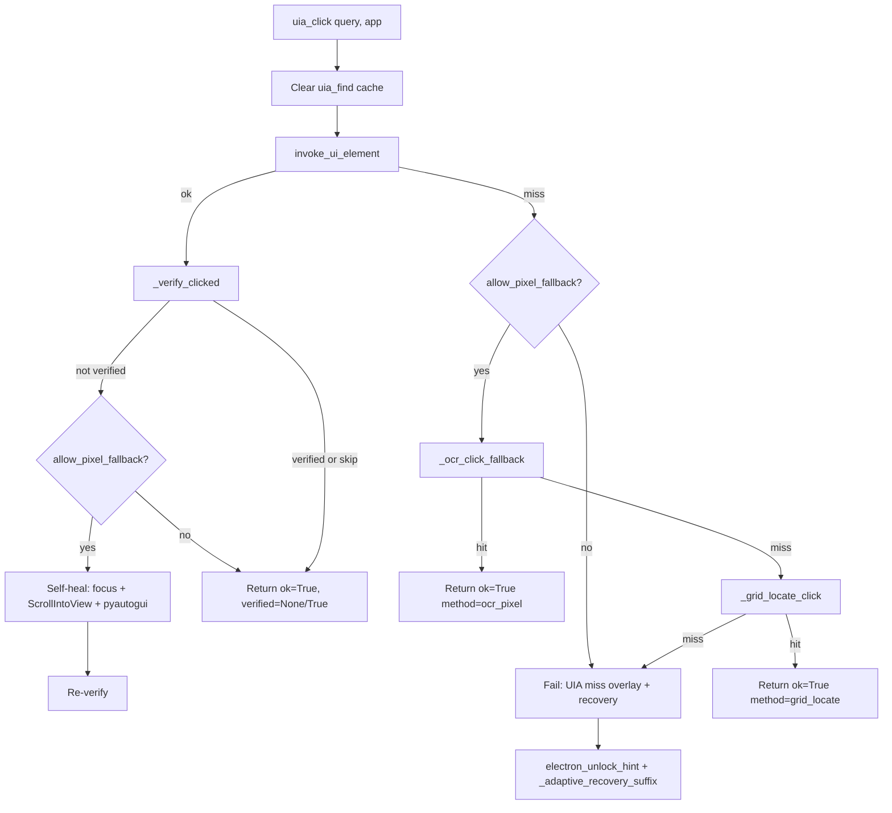

# Tools.py `uia_click` Ladder — Code Review

**Scope:** `C:\Users\ACER\Desktop\Ai_computer\Orynn\app\tools.py` — `uia_click` and its resolver ladder  
**Related:** `app\widget\desktop_features.py` (`invoke_ui_element`), `app\grid_locate.py`, `tests\test_hybrid_resolver.py`, `tests\test_grid_locate.py`  
**Review date:** 2026-06-22  
**Mode:** Read-only static review (no runtime execution)

---

## Executive summary

`uia_click` implements a **four-tier hybrid resolver** for clicking UI controls by name:

1. **UIA patterns** (no mouse) via `invoke_ui_element`
2. **Windows OCR text match + pixel click** (`_ocr_click_fallback`)
3. **Vision grid-locate (Set-of-Mark)** (`_grid_locate_click` → `grid_locate.locate`)
4. **Structured failure** with Electron unlock hint + adaptive recovery plan

On **success**, it adds **post-action verification** and optional **self-healing retry** (focus → scroll into view → pyautogui click).

The design is sound, fail-safe on vision misses, and well-tested for UIA/OCR tiers. Main gaps: **no integration test for grid-locate in `uia_click`**, **`uia_click_sequence` omits grid-locate**, and **primary-monitor-only** vision capture.

---

## Entry point

```3904:3997:C:\Users\ACER\Desktop\Ai_computer\Orynn\app\tools.py
def uia_click(self, query: str, app: str = "", allow_pixel_fallback: bool = True):
    from .widget.desktop_features import invoke_ui_element
    self._clear_uia_find_cache()
    before = self._click_snapshot()
    res = invoke_ui_element(query, app, allow_pixel_fallback=allow_pixel_fallback)
    if not res.get("ok"):
        if allow_pixel_fallback:
            ocr_result = self._ocr_click_fallback(query, app)
            ...
            grid_result = self._grid_locate_click(query, app)
            ...
        # failure path: overlay + electron hint + adaptive recovery
    ...
    verified = self._verify_clicked(before)
    if verified is not True and allow_pixel_fallback:
        # self-healing: focus → ScrollIntoView → pyautogui center click → re-verify
```

**Parameters:**

| Param | Default | Effect |
|-------|---------|--------|
| `query` | required | Control name / visible label to click |
| `app` | `""` | Window title hint for scoping find/OCR/focus |
| `allow_pixel_fallback` | `True` | When `False`, skips OCR, grid-locate, coordinate click, and self-healing retry |

---

## Resolver ladder (diagram)



---

## Tier 0 — Pre-click: cache + snapshot

- **`_clear_uia_find_cache()`** — Ensures stale find results don't affect a mutating click (consistent with `uia_type`, `uia_click_sequence`).
- **`_click_snapshot()`** — Captures foreground window + visible top-level HWND set **before** the click for post-action verification.

---

## Tier 1 — UIA (`invoke_ui_element`)

**File:** `C:\Users\ACER\Desktop\Ai_computer\Orynn\app\widget\desktop_features.py` (lines ~1869–1998)

Internal sub-ladder (all pattern-based, preferred over mouse):

| Order | Method | Purpose |
|-------|--------|---------|
| 0 | `ScrollItemPattern.ScrollIntoView` | Virtualized Electron lists |
| 1 | `InvokePattern` | Buttons, menus |
| 1b | `TogglePattern` | Checkboxes, switches |
| 2 | `SelectionItemPattern` | List/tree items (Discord channels) |
| 2b | `SetFocus` | Edit/Combo/Document (focus without click) |
| 2c | Ancestor `Invoke`/`Toggle` | Chromium wrappers (e.g. "New Agent") |
| 2d | `LegacyIAccessible.DoDefaultAction` | Native controls without Invoke |
| 3 | **Coordinate click** | Center of on-screen rect via pyautogui |

**Important:** Tier 1's coordinate click is **inside** `invoke_ui_element`, gated by `allow_pixel_fallback`. When `False`, it returns `needs_pixel_fallback` instead of moving the mouse — used by Gemini Live fast path (`textbox_overlay.py` line ~1689).

---

## Tier 2 — OCR pixel fallback

**Method:** `_ocr_click_fallback` (tools.py ~3246–3281)

- Calls `ocr_find_in_app(query, app)` in `desktop_features.py`
- Uses **Windows OCR** on app window rect (falls back to full screen if no window rect)
- Normalizes labels (`&`, `...`, punctuation) with word-boundary safety
- On hit: `_input_politeness_gate()` → `pyautogui.click(x, y)` → overlay tagged `"OCR fallback"`
- Records adaptive success: `resolver_id="ocr_text_target"`
- **Swallows exceptions** → returns `None` (caller continues ladder)

---

## Tier 3 — Vision grid-locate

**Method:** `_grid_locate_click` (tools.py ~3305–3350)  
**Engine:** `grid_locate.locate` (`C:\Users\ACER\Desktop\Ai_computer\Orynn\app\grid_locate.py`)

**Pre-click setup when `app` is set:**
1. `focus_window(app)`
2. `_wait_foreground(app, timeout=1.2)` — polls win32 until title matches, then 180ms repaint settle

**Vision pipeline:**
- Primary monitor capture via `mss` (monitors[1])
- Stage 1: 12×8 coarse grid → Gemini picks cell
- Stage 2: 6×6 fine grid in 3×3 zoom around stage-1 pick
- Model chain: `gemini-2.5-flash` → `gemini-2.5-flash-lite` → `gemini-flash-lite-latest` (override via `ORYNN_GRID_MODEL(S)`)
- **Fail-safe:** cell `0`, parse failure, missing API key, or model error → `None` (no wrong click)

**Scope:** Documented as **agent/back-office only**. Live path sets `allow_pixel_fallback=False`, so grid-locate is never reached from voice overlay.

---

## Tier 4 — Failure handling

When UIA + OCR + grid all miss (or pixel fallback disabled):

1. **Error overlay** — `control_layer="UIA miss"`, `fallback_reason="uia_no_match"`
2. **`_electron_unlock_hint`** — If target is Electron, attaches relaunch tip (`--force-renderer-accessibility`) so agent can self-heal before blind vision escalation
3. **`_adaptive_recovery_suffix`** — Calls `analyze_windows_failure` / `format_recovery_plan` from `adaptive_windows.py`; stores `data["adaptive"]`

---

## Success path — Verification + self-healing

### Verification (`_verify_clicked`)

- Sleeps 120ms, re-snapshots windows
- **`True`** if new top-level window appeared (menu/dialog) OR foreground changed
- **`None`** if no observable change — **never `False`** (legitimate no-op clicks stay `ok=True`)

### Self-healing retry (only when `verified is not True` and `allow_pixel_fallback=True`)

1. `focus_window(app)` + 80ms sleep
2. `_find_uia_control` + `ScrollItemPattern.ScrollIntoView`
3. Center-click bounding rect via pyautogui
4. Re-run `_verify_clicked`

This addresses cases where `InvokePattern` returned `ok=True` but had no visible effect.

---

## `allow_pixel_fallback` gate matrix

| Behavior | `True` (agent default) | `False` (Live fast path) |
|----------|------------------------|--------------------------|
| UIA pattern invoke | ✓ | ✓ |
| UIA coordinate click (tier 1.3) | ✓ | ✗ → `needs_pixel_fallback` |
| OCR fallback | ✓ | ✗ |
| Grid-locate fallback | ✓ | ✗ |
| Self-healing pyautogui retry | ✓ | ✗ |
| Failure → agent escalation | After all tiers miss | After UIA-only miss |

**Live wiring:** `textbox_overlay.py` ~1689 — `allow_pixel_fallback=not fast_invoke_only`

---

## Asymmetry: `uia_click_sequence`

`uia_click_sequence` (tools.py ~3793–3902) uses **UIA → OCR only** per step. It does **not** call `_grid_locate_click` on individual misses.

Additional sequence-only paths:
- Calculator keyboard fast path (before loop)
- Calculator keyboard fallback (after partial miss)
- `read_result` inline verification with calculator expected-value check

**Implication:** A sequence step that needs vision grid-locate will **stop** at OCR miss; agent must retry with single `uia_click` or another strategy.

---

## Adaptive memory

Successful OCR/grid fallbacks call `_remember_adaptive_success` with:
- `failure_class="uia_no_match"`
- `resolver_id`: `"ocr_text_target"` or `"vision_grid_locate"`

This feeds lazy playbooks in `adaptive_windows_profiles.json` for future runs.

---

## Test coverage

| Area | File | Status |
|------|------|--------|
| UIA miss → OCR hit | `tests/test_hybrid_resolver.py` | ✓ |
| UIA + OCR both miss | `tests/test_hybrid_resolver.py` | ✓ |
| Post-click verification | `tests/test_hybrid_resolver.py` | ✓ |
| Electron hint on hard miss | `tests/test_hybrid_resolver.py` | ✓ |
| Grid-locate coordinate math | `tests/test_grid_locate.py` | ✓ |
| Grid-locate fail-safe (cell 0, no key) | `tests/test_grid_locate.py` | ✓ |
| **`uia_click` → `_grid_locate_click` integration** | — | ✗ **Gap** |
| Self-healing retry path | — | ✗ **Gap** |
| `allow_pixel_fallback=False` skips tiers | — | ✗ **Gap** (partially implied by Live tests) |

---

## Risks and limitations

1. **Primary monitor only** — `grid_locate.locate` captures `mss.monitors[1]`. Apps on secondary displays may mis-click or miss.
2. **Full-screen vision** — Grid-locate snapshots entire primary screen, not app-scoped rect; relies on foreground wait when `app` is provided.
3. **Silent exception swallowing** — OCR and grid helpers return `None` on any exception; debugging requires logging or `ORYNN_GRID_DEBUG`.
4. **Sequence vs single-click parity** — Sequences lack grid tier; inconsistent resolver depth.
5. **REST API divergence** — `main.py` `/api/desktop/uia/click` calls legacy `click_ui_element`, **not** the hybrid `ToolExecutor.uia_click` ladder.
6. **Verification heuristic** — Window-set diff may miss in-app-only state changes (e.g. toggle with no new HWND).
7. **Self-healing uses pre-click snapshot** — Re-verify compares against original `before`, not a fresh mid-retry snapshot; may under-detect retry success in edge cases.

---

## Strengths

- Clear separation: **UIA-first, local OCR second, expensive vision last**
- Fail-safe vision contract (no click on uncertainty)
- Live path respects user mouse ownership via `allow_pixel_fallback=False`
- Rich overlay metadata for UI (`control_layer`, `control_reason`, `verified`)
- Electron unlock hint avoids blind vision escalation on locked DOM
- Adaptive recovery suffix gives agent actionable next steps
- Good unit test coverage for OCR ladder and verification semantics

---

## Recommendations (non-blocking)

1. Add `test_uia_click_falls_back_to_grid_on_uia_and_ocr_miss` mocking `grid_locate.locate`.
2. Add `test_uia_click_skips_pixel_tiers_when_fallback_disabled`.
3. Consider grid-locate as optional final step in `uia_click_sequence` when `stop_on_error=True` and `allow_pixel_fallback=True`.
4. Document or align REST `/api/desktop/uia/click` with `ToolExecutor.uia_click`.
5. Multi-monitor: pass monitor index from `app_window_rect` into `grid_locate.locate`.

---

## Key file references

| File | Role |
|------|------|
| `C:\Users\ACER\Desktop\Ai_computer\Orynn\app\tools.py` | `uia_click`, `_ocr_click_fallback`, `_grid_locate_click`, verification |
| `C:\Users\ACER\Desktop\Ai_computer\Orynn\app\widget\desktop_features.py` | `invoke_ui_element`, `ocr_find_in_app`, `_find_uia_control` |
| `C:\Users\ACER\Desktop\Ai_computer\Orynn\app\grid_locate.py` | Two-stage Set-of-Mark vision locate |
| `C:\Users\ACER\Desktop\Ai_computer\Orynn\app\widget\textbox_overlay.py` | Live fast path gating |
| `C:\Users\ACER\Desktop\Ai_computer\Orynn\tests\test_hybrid_resolver.py` | Hybrid resolver tests |
| `C:\Users\ACER\Desktop\Ai_computer\Orynn\tests\test_grid_locate.py` | Grid-locate unit tests |
