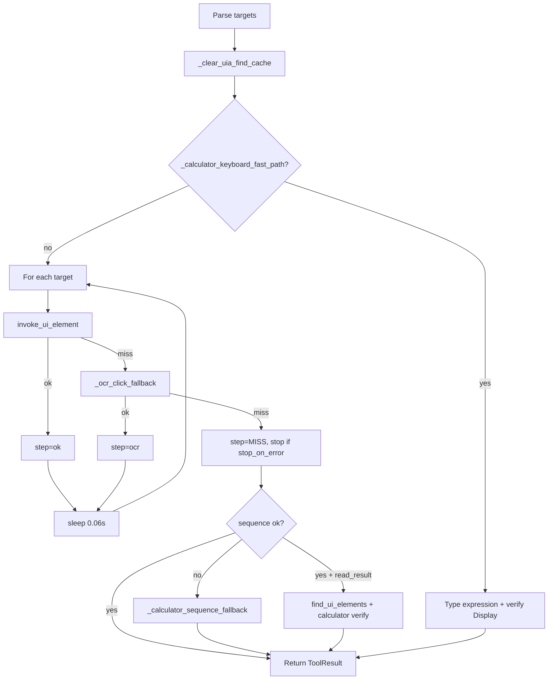

# `uia_click_sequence` — Code Review

**Source:** `C:\Users\ACER\Desktop\Ai_computer\Orynn\app\tools.py`  
**Primary symbol:** `ToolExecutor.uia_click_sequence` (lines 3793–3902)  
**Related helpers:** `_calculator_keyboard_fast_path` (3656–3724), `_calculator_sequence_fallback` (3726–3791), `_calculator_expression_from_targets` (3530–3542), `_calculator_read_result` (3623–3644)

---

## 1. Purpose

`uia_click_sequence` collapses an **ordered list of control clicks** into a **single tool round-trip**. The design goal is reliability: the agent cannot drift between intermediate turns when entering Calculator digits, walking a form, or pressing a known menu chain.

Each target is resolved via **UIA `InvokePattern`** (`invoke_ui_element`), with **OCR pixel-click** fallback per step (same as `uia_click`, but not the grid-locate tier). Optional **`read_result`** reads a result control (e.g. Calculator `"Display"`) in the **same call**, avoiding a follow-up `uia_find`.

---

## 2. Public API

| Parameter | Type | Default | Notes |
|-----------|------|---------|-------|
| `targets` | `list[str]` or comma-separated `str` | required | Normalized to stripped string list |
| `app` | `str` | `""` | Window title filter |
| `stop_on_error` | `bool` | `True` | Break loop on first miss |
| `read_result` | `str` | `""` | Control name to read after success |

**Dispatch aliases** (`run_action`, line 4488): `targets` → `queries` → `query`.

**Schema:** `read_result` is optional in derived JSON schema (`test_uia_click_sequence_schema_exposes_read_result`). `stop_on_error` is **not** exposed in the native tool schema.

---

## 3. Execution Flow



### Step 0 — Cache clear
Calls `_clear_uia_find_cache()` before any mutation (consistent with `uia_click` / `uia_type`).

### Step 1 — Calculator keyboard fast path (pre-loop)
`_calculator_keyboard_fast_path` runs **before** the UIA loop when **all** of:
- `read_result` is set
- `app` matches Calculator (`_is_calculator_target`)
- Targets map to a valid expression with computable expected result
- User is **not** actively typing (`input_polite_enabled` + `_user_actively_typing`)
- Calculator is **verified foreground** (`_calculator_foreground_verified`)

Behavior: `Escape` → `pyautogui.write(expression)` → poll Display until match or timeout.

Returns `ok=False` if verification fails (stricter than the post-failure fallback).

### Step 2 — Main UIA/OCR loop
For each target:
1. `invoke_ui_element(tgt, app)` — no `allow_pixel_fallback` kwarg (pixel fallback is manual via `_ocr_click_fallback`)
2. On miss → `_ocr_click_fallback`
3. On continued miss → record `failed`, append `=MISS`, break if `stop_on_error`
4. `time.sleep(0.06)` between successful steps

### Step 3 — Calculator keyboard fallback (on full-sequence failure)
If any target failed and app is Calculator → `_calculator_sequence_fallback`:
- `focus_window` + foreground verification (safety against typing into wrong window)
- `_input_politeness_gate()` before keystrokes
- Types expression; reads result via UIA poll + clipboard (`Ctrl+C`) backup
- Returns `ok=True` even when UIA failed (keyboard path succeeded)

### Step 4 — `read_result` (success path only)
After all clicks succeed:
- Single `find_ui_elements` read
- For Calculator: compare to `_calculator_expected_result`; settle 0.45s and re-read once on mismatch; escalate to `_calculator_sequence_fallback` if still wrong
- Exceptions in read block are **swallowed** (`except Exception: pass`)

### Step 5 — Failure enrichment
On miss:
- `_electron_unlock_hint` for Electron apps
- `_adaptive_recovery_suffix` → `adaptive_windows.analyze_windows_failure` with action `"uia_click_sequence"`

---

## 4. Calculator Expression Mapping

`_calculator_key_for_target` maps spoken/digit names to keystrokes (`"Multiply by"` → `*`, `"Equals"` → `=`, etc.). `"Clear"` targets are skipped. Expression must contain at least one digit.

`_calculator_expected_result` handles chained `=` segments (e.g. `12+8=*5`) via AST evaluation — regression fix for Groq runs where mid-string `=` broke verification.

---

## 5. Comparison with `uia_click`

| Capability | `uia_click` | `uia_click_sequence` |
|------------|-------------|----------------------|
| UIA invoke | yes | yes (per step) |
| OCR fallback | yes | yes (per step) |
| Grid-locate (Set-of-Mark) | yes | **no** |
| `_click_snapshot` before | yes | **no** |
| `_remember_adaptive_success` on OCR | yes | **no** (OCR steps don't record adaptive memory) |
| Calculator keyboard paths | no | yes (fast + fallback) |
| Inline result read | no | yes (`read_result`) |
| Adaptive recovery on fail | yes | yes |

**Gap:** Canvas/Electron controls with no UIA tree and no OCR-visible text will fail the whole sequence at the first miss, whereas a single `uia_click` can still try `_grid_locate_click`.

---

## 6. Return Contract (`ToolResult`)

### Success (UIA path)
```python
data = {
    "ok": True,
    "clicked": N,
    "total": N,
    "steps": ["Two=ok", "Plus=ocr", ...],
    "failed": None,
    "result": "...",        # if read_result succeeded
    "overlay": {...},
}
```

### Failure
```python
data = {
    "ok": False,
    "clicked": k,           # steps completed before miss
    "total": N,
    "steps": ["Two=ok", "Nine=MISS"],
    "failed": "Nine",
    "overlay": {"fallback_reason": "uia_no_match", ...},
    "electron_hint": {...}, # optional
    "adaptive": {...},      # optional
}
```

### Calculator fallback variants
`data["fallback"]` ∈ `"calculator_keyboard_fast"` | `"calculator_keyboard"` plus `expression`, and optionally `expected`.

**Output format inconsistency:** calculator paths join steps with `" -> "`; main path uses `" → "`.

---

## 7. Integration Points

| Location | Role |
|----------|------|
| `app/tool_registry.py` | Tool description, `uia` pack membership |
| `app/agent.py` | Overlay label for multi-target preview; prompt examples for Calculator |
| `app/adaptive_windows.py` | Recovery plan: `split_sequence_at_miss`, `keyboard_shortcut_path`, `screen_context` |
| `app/permissions.py` | Listed as permitted desktop action |
| `app/models.py` | `ActionType.uia_click_sequence` |

---

## 8. Test Coverage

**File:** `C:\Users\ACER\Desktop\Ai_computer\Orynn\tests\test_hybrid_resolver.py`

| Test | What it proves |
|------|----------------|
| `test_uia_click_sequence_one_call` | All targets invoked in one call, order preserved |
| `test_uia_click_sequence_reads_result_in_same_call` | `read_result` populates `data["result"]` |
| `test_uia_click_sequence_stops_on_miss` | `stop_on_error` stops at first miss |
| `test_uia_click_sequence_calculator_uses_keyboard_fallback` | UIA fail → keyboard + clipboard read |
| `test_uia_click_sequence_calculator_fast_keyboard_when_idle` | Fast path skips UIA loop |
| `test_uia_click_sequence_calculator_fast_keyboard_skips_when_user_active` | Politeness defers to UIA |
| `test_uia_click_sequence_calculator_fallback_on_wrong_display` | Wrong Display → keyboard fallback |
| `test_uia_click_sequence_adds_electron_hint_on_hard_miss` | Electron hint on Discord miss |

**File:** `test_computer_control_regressions.py` — schema exposes `read_result`.

**Not tested:** `stop_on_error=False` continuation, comma-string vs list parity edge cases, grid-locate absence, swallowed `read_result` exceptions, non-Calculator `read_result` paths.

---

## 9. Strengths

1. **Single-turn reliability** — core product value for multi-click workflows.
2. **Calculator specialization** — three-tier strategy (fast keyboard → UIA → keyboard fallback) with foreground verification and chained-expression math verification.
3. **Safety** — `_calculator_foreground_verified` prevents keystrokes landing in the user's active window; politeness gate respects active typing.
4. **Failure UX** — per-step trace (`steps`), electron hints, adaptive recovery suffix.
5. **Verify-in-same-call** — `read_result` saves a model turn on Calculator and similar apps.

---

## 10. Risks and Recommendations

| Severity | Issue | Recommendation |
|----------|-------|----------------|
| Medium | No grid-locate fallback per step | Consider optional `_grid_locate_click` after OCR miss (mirror `uia_click`) for canvas-heavy sequences |
| Medium | Fast path requires `read_result` | Document that Calculator speed path only triggers with `read_result="Display"`; without it, always walks UIA |
| Low | `read_result` errors silently swallowed | Log or append `(read failed: …)` to output |
| Low | OCR hits don't call `_remember_adaptive_success` | Align with `uia_click` for adaptive learning |
| Low | `stop_on_error` not in tool schema | Add to schema if models should continue partial sequences |
| Low | Output arrow inconsistency (`->` vs `→`) | Normalize for parser stability |
| Low | Fixed 0.06s inter-click delay | May be insufficient for slow Electron re-renders; consider configurable settle or `uia_wait` hook |
| Info | `invoke_ui_element` called without `allow_pixel_fallback` | Intentional — OCR is separate; matches test mocks |

---

## 11. When to Use (Agent Guidance)

**Prefer `uia_click_sequence` when:**
- Target order is known upfront (Calculator, wizard Next/Next/Finish)
- Verification can be inlined (`read_result="Display"`)
- Reducing model turns matters more than per-step observability

**Prefer separate `uia_click` calls when:**
- Each step needs screenshot/observe between clicks
- Targets are on canvas with no OCR text (grid-locate only on single click today)
- Mid-sequence UI state is unpredictable

**Example (from registry):**
```json
{
  "targets": ["Two", "Five", "Six", "Minus", "Eight", "Nine", "Equals"],
  "app": "Calculator",
  "read_result": "Display"
}
```

---

## 12. Verdict

`uia_click_sequence` is a **well-tested, purpose-built batch invoke** with meaningful Calculator optimizations and good failure reporting. It is production-ready for name-based UIA/OCR sequences. Main extension opportunity: **parity with `uia_click`'s grid-locate tier** for Electron/canvas sequences where OCR also fails.

---

To persist this file, switch to **Agent mode** and ask to write `C:\Users\ACER\Desktop\Ai_computer\Orynn\docs\subagent-storm\backoffice\03-tools-uia-sequence-review.md` (create `subagent-storm/backoffice/` if missing).
