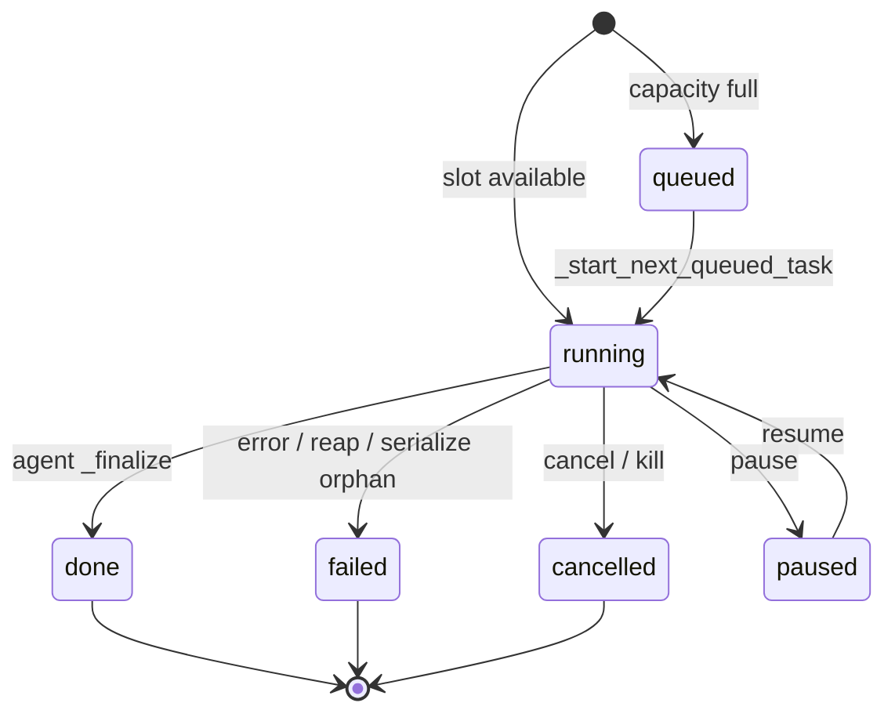

# 04 — `main.py` Task Lifecycle & `_serialize_task_record` Review

**Scope:** `C:\Users\ACER\Desktop\Ai_computer\Orynn\app\main.py`  
**Related:** `app\models.py` (`TaskRecord`), `app\agent.py` (`AgentService`), `tests\test_task_abandon_grace.py`  
**Date:** 2026-06-22

---

## Executive summary

Task lifecycle in `main.py` is a **dual-layer model**: persisted `TaskRecord` objects (in-memory `_tasks` + JSON under `{workspace}/tasks/`) plus live asyncio coroutines in `service._active_tasks`. A queue (`_queued_task_specs`) and watchdog (`_queue_watchdog_loop`) keep concurrency bounded and self-healing.

`_serialize_task_record` is the **API view layer** that reconciles persisted state with live server state. It is not a pure serializer: for non-terminal records that appear orphaned (no coroutine, not paused, not queued, past startup grace), it **mutates and persists** the record as `failed` with a human-readable reason. That design fixed the “Open Spotify → Failed: abandoned in ~270ms” bug but introduces **read-path side effects** and one consumer inconsistency.

---

## Architecture overview



### Core globals (main.py)

| Symbol | Role |
|--------|------|
| `_tasks: Dict[str, TaskRecord]` | In-memory task registry |
| `_queued_task_specs: List[Dict]` | FIFO specs waiting for a concurrency slot |
| `service._active_tasks` | `task_id → asyncio.Task` (AgentService) |
| `task_store_dir` | `{ORYNN_WORKSPACE}/tasks/*.json` |
| `_MAX_ACTIVE_TASKS` | Concurrency cap (default 5, env override) |
| `_WATCHDOG_INTERVAL` | Queue watchdog tick (default 5s) |
| `_TASK_MAX_RUNTIME` | Hard fail ceiling (default 900s) |
| `_TASK_START_GRACE` | Startup grace before orphan detection (default 4s) |

### Lifespan hooks

On startup (`_lifespan`):

- MCP init, Telegram/Discord/automation pollers
- `_queue_watchdog_loop`: every `_WATCHDOG_INTERVAL`, calls `_reap_stuck_tasks()` + `_start_next_queued_task()`

On shutdown: cancels background tasks, `service.shutdown()`.

---

## Lifecycle phases

### 1. Persistence bootstrap — `_load_persisted_tasks()`

**Path:** `task_store_dir/*.json` + orphan logs via `log_emitter.task_ids()`.

On load:

1. Merge terminal status from log inference when logs say done/failed/cancelled.
2. **Any record still `running` / `paused` / `pending` → forced `failed`** with reason `"Server restarted while task was active."`
3. Same for log-only tasks without JSON metadata.
4. Cap loaded count via `ORYNN_MAX_PERSISTED_TASKS` (default 250).

This is the **restart reconciliation** path — distinct from runtime orphan detection in `_serialize_task_record`.

### 2. Submission — `create_task` / `_submit_managed_task`

Shared flow:

1. Validate `task_id`, model selection, preflight/readiness.
2. Build `spec` dict (goal, model, mode, environment, etc.).
3. If `_count_active_tasks() >= _MAX_ACTIVE_TASKS`:
   - Create `TaskRecord(status="queued")`, append spec to `_queued_task_specs`, persist, emit `queued` log event.
4. Else: `_start_task_from_spec(spec)` → `service.init_task(...)` → coroutine in `_active_tasks`, status `"running"`.

External sources (Telegram, Discord, automation) use `_submit_managed_task`.

### 3. Execution start — `_start_task_from_spec`

- Calls `service.init_task(...)` (agent sets `status="running"`, spawns `run_task` coroutine).
- Stores in `_tasks`, `_save_task_record`, emits `task_started`.

### 4. Active-slot accounting — `_count_active_tasks`

Counts coroutines that are:

- Not `task.done()`, **and**
- Record not terminal (avoids zombie slot leaks).

### 5. Self-healing — `_reap_stuck_tasks`

Per active coroutine:

| Condition | Action |
|-----------|--------|
| `task.done()` | Remove from `_active_tasks` |
| Record terminal but coroutine alive | `task.cancel()`, remove (zombie) |
| Age > `_TASK_MAX_RUNTIME` | Cancel, set `failed`, persist, remove |

### 6. Queue drain — `_start_next_queued_task`

While queue non-empty and capacity available:

- Pop spec, verify record still `queued`, call `_start_task_from_spec`.
- On start failure: mark record `failed`, emit error.

### 7. Completion — `_on_complete` (wired to `service._on_task_complete`)

Called from `AgentService._finalize`:

1. Update record: status, `finished_at`, `reason`, clear `paused`.
2. Side effects: hooks, git checkpoint, notifications.
3. Persist, `log_emitter.cleanup_task`, `_evict_old_tasks`.
4. Remove from `service._active_tasks`, `_start_next_queued_task()`.

Note: `AgentService.run_task` `finally` also pops `_active_tasks` — redundant but safe.

### 8. User actions

| Endpoint | Behavior |
|----------|----------|
| `cancel_task` | Queued: remove from queue + mark cancelled. Running: `service.cancel_task`. |
| `kill_task` | Sets kill flag + cancels coroutine; also handles queued. |
| `pause_task` / `resume_task` | Record flag + `service.pause_task` / `resume_task`. |

---

## Status model

### Terminal statuses — `_is_terminal_status`

```python
{"done", "failed", "cancelled", "complete", "error"}
```

Broader than `TaskStatus` enum in `models.py` (`pending`, `running`, `done`, `failed`, `cancelled`).

### Persisted vs derived status

| Persisted `record.status` | `_serialize_task_record` may expose |
|---------------------------|-------------------------------------|
| `queued` | `queued` (if in `_queued_task_specs`) |
| `running` | `running`, `paused`, or `failed` (orphan path) |
| terminal | unchanged (+ `complete` flag from logs) |

**Derived fields added to API payload:**

- `paused` — false if terminal; else record flag OR `record.id in service._paused_tasks`
- `server_running` — coroutine exists and not done
- `complete` — for terminal only, from last `done` log event

---

## `_serialize_task_record` — deep dive

**Location:** `main.py` lines 608–646

### Algorithm

```
1. payload = record.model_dump()
2. terminal = _is_terminal_status(record.status)
3. Set paused, server_running
4. If terminal → set payload["complete"] from logs; return (mostly as-is)

5. If NOT terminal:
   a. Check is_queued (spec in _queued_task_specs)
   b. If server_running OR paused OR is_queued:
      → derive status: paused | queued | running
   c. Else (orphan candidate):
      - If age < _TASK_START_GRACE:
        → force status=running, server_running=True, return early
      - Else:
        → MUTATE record: status=failed, reason from _task_done_exception
          or existing reason or "the task ended before it could run"
        → set finished_at, paused=False
        → _save_task_record(record)
        → rebuild payload as failed
6. return payload
```

### Design intent (from comments + tests)

1. **Startup grace:** Fresh tasks without a live coroutine yet must not flash as failed/abandoned during the first ~4s (`ORYNN_TASK_START_GRACE`).
2. **Human failure reasons:** Stale orphans get `_task_done_exception()` text instead of opaque “abandoned” / “Server restarted” strings shown in Live UI.
3. **Live status overlay:** Paused/queued/running derived from runtime state, not only persisted JSON.

### Helpers

| Function | Purpose |
|----------|---------|
| `_record_age_seconds` | ISO `created_at` → age in seconds |
| `_task_is_server_running` | Coroutine in `_active_tasks` and not done |
| `_task_done_exception` | Extract exception/cancel message from finished coroutine |
| `_task_complete_from_log` | Read `done` event `complete` flag for terminal tasks |

### Side effects (important)

`_serialize_task_record` is invoked from **GET** handlers:

- `GET /api/tasks/{task_id}` → `get_task`
- `GET /api/tasks` → `get_all_tasks`
- `GET /api/active-tasks` → `get_active_tasks`
- `_build_trust_report` → trust dashboard

**Polling can persist failures.** A client repeatedly hitting `GET /api/tasks/{id}` can be the mechanism that finalizes an orphan as `failed`, not just `_on_complete` or the watchdog.

**In-place mutation:** The function modifies the passed `TaskRecord` object (`record.status`, `record.reason`, etc.), not only the returned dict.

### Test coverage

`tests/test_task_abandon_grace.py`:

- Fresh task (0.2s old, no coroutine) → serialized as `running`.
- Stale task (grace + 5s) → `failed`, reason without “abandoned” or “Server restarted”.

---

## API consumers

| Consumer | Serialization | Post-filter |
|----------|---------------|-------------|
| `get_task` | `_serialize_task_record` | none |
| `get_all_tasks` | per task | none |
| `get_active_tasks` | per task | **skips if serialized status terminal** ✓ |
| `_build_trust_report` | non-terminal **raw** records only | **no post-filter on serialized status** ⚠ |
| `stream_task` | uses `_get_task_record` + raw `record.status` for early exit | separate from serialize |

---

## Findings & risks

### High

1. **Read-path persistence in `_serialize_task_record`**  
   GET requests can write disk. Surprising for caching, auditing, and “who finalized this task?” debugging. Consider moving orphan detection to watchdog-only or an explicit reconcile job.

2. **`_build_trust_report` active-task leak**  
   Filters on **pre-serialize** `record.status`. A stale `running` record that serialize converts to `failed` still lands in `active_records`. `get_active_tasks` correctly filters **post-serialize**.

### Medium

3. **Dual orphan narratives**  
   - Restart: `"Server restarted while task was active."` (`_load_persisted_tasks`)  
   - Runtime: exception text or `"the task ended before it could run"` (`_serialize_task_record`)  
   Same underlying condition, different user-facing copy.

4. **Grace period masks `server_running=false`**  
   During grace, payload reports `server_running=True` even when no coroutine exists. Intentional for UI stability; can confuse diagnostics that trust `server_running` literally.

5. **Status vocabulary drift**  
   `_is_terminal_status` includes `complete` / `error`; persisted records and enum use overlapping but not identical sets. Frontend (`qt_shell.py`) mirrors terminal set independently.

6. **`_queued_task_specs` is in-memory only**  
   Restart loses queue ordering/specs; persisted `queued` records remain but won’t auto-start without separate recovery logic (they become failed on next load only if status is `running`/`paused`/`pending` — **`queued` is NOT in that restart-fail list**). Verify whether queued tasks survive restart correctly.

### Low

7. **`get_all_tasks` includes tasks that serialize to terminal** even if raw status was non-terminal — list may briefly show tasks that active-tasks excludes.

8. **Agent `finally` vs `_on_complete` ordering** — `_active_tasks` popped in both places; harmless but makes `_task_is_server_running` false before serialize in some narrow windows.

---

## Environment knobs

| Variable | Default | Effect |
|----------|---------|--------|
| `ORYNN_TASK_START_GRACE` | 4.0 | Orphan detection delay |
| `ORYNN_MAX_ACTIVE_TASKS` | 5 | Concurrency cap |
| `ORYNN_WATCHDOG_INTERVAL` | 5 | Reap + queue drain period |
| `ORYNN_TASK_MAX_RUNTIME` | 900 | Force-fail hung tasks |
| `ORYNN_MAX_PERSISTED_TASKS` | 250 | Startup load cap |
| `ORYNN_MAX_IN_MEMORY_TASKS` | 200 | In-memory eviction of terminal tasks |
| `ORYNN_WORKSPACE` | `.` | Task JSON + logs root |

---

## Recommendations (non-blocking)

1. **Extract orphan reconciliation** from `_serialize_task_record` into `_reconcile_orphan_task(record) -> TaskRecord`, called from watchdog + optional explicit path; keep serialize read-only (dict only).
2. **Align `_build_trust_report`** with `get_active_tasks`: filter on serialized `payload["status"]`.
3. **Document restart behavior for `queued`** — confirm whether queued tasks should restart or fail on boot.
4. **Centralize terminal status constants** shared by backend, `qt_shell`, and tests.
5. **Add test** for trust report not listing serialize-to-failed tasks as active.

---

## Key code references

**Serialize + grace:**

```608:646:C:\Users\ACER\Desktop\Ai_computer\Orynn\app\main.py
def _serialize_task_record(record: TaskRecord) -> dict:
    payload = record.model_dump()
    terminal = _is_terminal_status(record.status)
    payload["paused"] = False if terminal else bool(record.paused or record.id in service._paused_tasks)
    payload["server_running"] = _task_is_server_running(record.id)
    if terminal:
        payload["complete"] = _task_complete_from_log(record.id, record.status)

    is_queued = any(spec["task_id"] == record.id for spec in _queued_task_specs)
    if not terminal:
        if payload["server_running"] or payload["paused"] or is_queued:
            payload["status"] = "paused" if payload["paused"] else ("queued" if is_queued else "running")
        else:
            age = _record_age_seconds(record)
            if age is not None and age < _TASK_START_GRACE:
                payload["status"] = "running"
                payload["server_running"] = True
                return payload
            record.status = "failed"
            record.reason = (
                _task_done_exception(record.id)
                or record.reason
                or "the task ended before it could run"
            )
            record.finished_at = record.finished_at or datetime.now(timezone.utc).isoformat()
            record.paused = False
            _save_task_record(record)
            payload = record.model_dump()
            payload["paused"] = False
            payload["server_running"] = False
            payload["status"] = "failed"
    return payload
```

**Completion callback:**

```815:834:C:\Users\ACER\Desktop\Ai_computer\Orynn\app\main.py
def _on_complete(task_id: str, status: str, reason: str):
    rec = _tasks.get(task_id)
    if rec:
        rec.status = status
        rec.paused = False
        rec.finished_at = datetime.now(timezone.utc).isoformat()
        rec.reason = reason
        # ... side effects ...
        _save_task_record(rec)
        log_emitter.cleanup_task(task_id)
        _evict_old_tasks()
    service._active_tasks.pop(task_id, None)
    _start_next_queued_task()

service._on_task_complete = _on_complete
```

**Restart fail-closed load:**

```508:513:C:\Users\ACER\Desktop\Ai_computer\Orynn\app\main.py
        if record.status in {"running", "paused", "pending"}:
            record.status = "failed"
            record.reason = record.reason or "Server restarted while task was active."
            record.finished_at = record.finished_at or datetime.now(timezone.utc).isoformat()
            record.paused = False
            _save_task_record(record)
```

---

## Files touched by this review

- `C:\Users\ACER\Desktop\Ai_computer\Orynn\app\main.py` — primary
- `C:\Users\ACER\Desktop\Ai_computer\Orynn\app\models.py` — `TaskRecord`
- `C:\Users\ACER\Desktop\Ai_computer\Orynn\app\agent.py` — coroutine lifecycle
- `C:\Users\ACER\Desktop\Ai_computer\Orynn\tests\test_task_abandon_grace.py` — grace/orphan tests
- `C:\Users\ACER\Desktop\Ai_computer\Orynn\app\widget\qt_shell.py` — client terminal-status mirror
- `C:\Users\ACER\Desktop\Ai_computer\Orynn\app\widget\textbox_overlay.py` — Live UI reason sanitization
