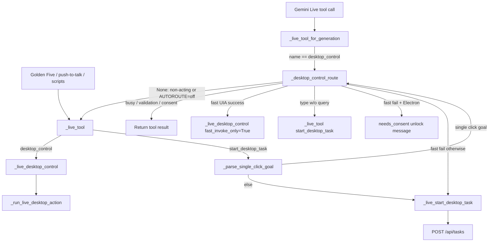

# Desktop Control Route Review

**Scope:** `desktop_control` routing in `C:\Users\ACER\Desktop\Ai_computer\Orynn\app\widget\textbox_overlay.py`  
**Date:** 2026-06-22  
**Primary file:** `C:\Users\ACER\Desktop\Ai_computer\Orynn\app\widget\textbox_overlay.py`

---

## Executive summary

`desktop_control` has **two distinct entry paths**:

| Path | Entry | `click` / `type` behavior |
|------|--------|---------------------------|
| **Model (Gemini Live)** | `_live_tool_for_generation` → `_desktop_control_route` | Fast UIA-only attempt, then optional escalation to back-office agent (`start_desktop_task`) |
| **Deterministic gateway** | `_live_tool("desktop_control", …)` direct | Bounded UIA primitive only — **no** fast-then-escalate routing |

The model path is designed for voice: try a ~1–4s UIA action first (no agent spin-up, no `enable_desktop_control` prompt, no pixel/mouse fallback on the fast tier), then escalate to the full agent only when UIA cannot complete the action cleanly.

---

## Architecture



**Wiring:** Gemini Live registers `on_tool` as `_live_tool_for_generation` (line ~1188). Scripts like `golden_reliability.py` call `_live_tool` directly.

---

## Core symbols

| Symbol | Lines | Role |
|--------|-------|------|
| `LIVE_UPGRADE_ACTIONS` | 111 | `{"click", "type"}` — only actions eligible for fast-then-escalate |
| `LIVE_DESKTOP_ACTIONS` | 88–100 | All supported `desktop_control` actions |
| `_parse_single_click_goal` | 228–248 | Rewrites `start_desktop_task` single-click goals → `desktop_control` args |
| `_goal_from_desktop_control` | 1731–1748 | Converts click/type args → natural-language goal for agent |
| `_desktop_control_route` | 1761–1849 | **Model-path router** for click/type |
| `_live_desktop_control` | 1868–1888 | UI labels, cancellation, wraps `_run_live_desktop_action` |
| `_live_tool_for_generation` | 1890–1901 | Model boundary — routes `desktop_control` before `_live_tool` |
| `_live_tool` | 2180–2259 | Universal dispatcher; deterministic path for `desktop_control` |
| `_busy_response` | 2159–2178 | Blocks concurrent desktop actions |
| `_live_start_desktop_task` | 2445–2522 | Spawns back-office agent via `/api/tasks` |

---

## `_desktop_control_route` decision tree

Applies only when `ORYNN_LIVE_AUTOROUTE` is **not** `off` and `action ∈ {"click", "type"}`.

1. **Non-acting actions** (`observe`, `find`, `wait`, `focus_window`, `press_keys`, `scroll`, …) → return `None` → fall through to bounded primitive in `_live_tool`.

2. **Busy gate** (first) — `_busy_response()`  
   Prevents UIA fast path from running on top of an active agent task. Regression test: `test_fast_click_blocked_when_a_task_is_running`.

3. **Validation** (internal model errors, no bubble flash):
   - `click` without `query` → `ok: false`, `"Missing query for click."`
   - `type` without non-empty `text` → `ok: false`, `"Missing text for type."`

4. **Consent gate** — `_goal_needs_consent(goal)` via `LIVE_CONSENT_RE`  
   Disruptive verbs (send, delete, submit, relaunch, …). `desktop_control` has no `confirmed` flag; model is instructed to re-call `start_desktop_task` with `confirmed=true` after spoken yes.

5. **Type without `query`** — cannot UIA-target a field → quiet escalate via `_live_tool("start_desktop_task", {goal})` (no fast attempt).

6. **Fast path** — `_live_desktop_control(args, fast_invoke_only=True)`  
   - `uia_click` / `uia_type` with `allow_pixel_fallback=False`  
   - Success + not soft-fail → return immediately  
   - Soft-fail: `ok=true` but `data.verified is False` → treat as failure, escalate (`_fast_result_is_soft_fail`)

7. **Electron consent** — if fast failed and `_looks_like_electron(app)` (substring match on `LIVE_ELECTRON_APP_HINTS`) → `needs_consent: true`, message about possible relaunch/unlock. Model must use `start_desktop_task` + `confirmed=true`.

8. **Agent escalation** — `_live_start_desktop_task({"goal": goal})` for native-app failures or post-consent paths.

---

## `_live_tool` behavior

### `desktop_control`
- Busy gate → `_live_desktop_control` (full primitive, **with** pixel fallback unless caller used fast path internally).

### `start_desktop_task`
- Busy gate
- If goal matches `_parse_single_click_goal` → `_desktop_control_route(click_args)` (inherits `confirmed` if present)
- Else → `_live_start_desktop_task`

**Reverse routing:** A model that over-calls `start_desktop_task` for a single click can still hit the fast path (`test_start_desktop_task_single_click_redirects_to_fast_path`).

---

## Safety and concurrency

| Gate | Where | Purpose |
|------|--------|---------|
| Busy | `_desktop_control_route` + `_live_tool` | One desktop driver at a time |
| Consent | Route + `_live_start_desktop_task` | Voice approval before destructive/outward actions |
| Electron unlock | Route only | Spoken OK before agent may relaunch Electron apps |
| Blocked keys | `_run_live_desktop_action` / `press_keys` | Blocks Alt+F4, Win+L, Orynn hotkeys, etc. |
| One desktop tool per turn | `gemini_live.py` ~852–871 | Rejects batch with both `desktop_control` and `start_desktop_task` |

`stop_current_task` and `get_companion_status` are intentionally **not** busy-gated.

---

## Environment flags

| Variable | Effect |
|----------|--------|
| `ORYNN_LIVE_AUTOROUTE=off` | `_desktop_control_route` returns `None` for click/type → direct `_live_desktop_control`, no agent escalation on failure |
| `ORYNN_LIVE_TASK_WAIT` | How long Live waits for task outcome after spawn |
| `GEMINI_LIVE_TOOL_TIMEOUT` | Outer tool timeout (15s default); inner waits capped below this |

---

## Action matrix

| Action | Model path | Escalates? | Notes |
|--------|------------|------------|-------|
| `click` | Fast UIA → agent | Yes (unless AUTOROUTE=off or fast succeeds) | UIA-only on fast tier |
| `type` (with `query`) | Fast UIA → agent | Same | `submit=true` triggers consent |
| `type` (no `query`) | → `start_desktop_task` | Always (agent job) | Skips fast path |
| `observe`, `find`, `wait` | Bounded primitive | Never | Read-only / inspection |
| `focus_window`, `wait_for_window` | Bounded primitive | Never | |
| `press_keys`, `scroll` | Bounded primitive | Never | Keys filtered |

---

## Test coverage (representative)

File: `C:\Users\ACER\Desktop\Ai_computer\Orynn\tests\test_gemini_live.py`

- Fast path, no agent: `test_model_click_uses_fast_path_no_agent`, `test_model_type_uses_fast_path_no_agent`
- Escalation: `test_model_click_escalates_on_fast_failure`, `test_model_type_escalates_when_unverified`, `test_model_click_escalates_when_click_unverified`
- Electron consent: `test_electron_click_asks_consent_before_unlock`, `test_non_electron_click_escalates_without_unlock_consent`
- AUTOROUTE off: `test_live_autoroute_off_disables_escalation`
- Deterministic vs model: `test_deterministic_gateway_click_stays_direct_uia`, `test_deterministic_gateway_type_stays_direct_uia`
- Busy gate: `test_fast_click_blocked_when_a_task_is_running`
- Reverse route: `test_start_desktop_task_single_click_redirects_to_fast_path`
- Consent: `test_live_type_with_submit_carries_submit_and_needs_consent`, `test_consent_gate_keyword_boundaries`

---

## Observations and risks

### Strengths
- Clear separation of model vs deterministic paths preserves Golden Five reliability.
- Busy gate duplicated at route entry fixes interleaving UIA with running agent (see `debug-eec63b.log` hypothesis F).
- Soft-fail (`verified: false`) avoids false “done” on unconfirmed UIA actions.
- Electron relaunch gets explicit consent before agent spawn.

### Gaps / edge cases

1. **Escalation bypasses `_live_tool` busy re-check**  
   Line 1849 calls `_live_start_desktop_task` directly after fast failure. Busy was checked at route entry; a race if another task starts during the fast attempt is theoretically possible but unlikely.

2. **`confirmed` only on `start_desktop_task`**  
   `desktop_control` checks `args.get("confirmed")` for consent/electron, but the tool schema likely does not expose `confirmed` on `desktop_control`. Consent recovery always goes through `start_desktop_task` — correct by design, but models may need clear prompting.

3. **Electron detection is substring heuristic**  
   `_looks_like_electron` matches hints like `"cursor"` anywhere in app/title — false positives/negatives possible.

4. **Workflow steps use `_live_desktop_control` directly**  
   `_run_workflow_step` (~2035) bypasses model routing — no escalation for failed workflow clicks/types.

5. **Type escalation path inconsistency**  
   Type-without-query uses `_live_tool("start_desktop_task")` (re-parses, re-busy-checks); fast-fail escalation uses `_live_start_desktop_task` directly. Functionally OK; slightly asymmetric.

6. **AUTOROUTE=off changes model path to match gateway**  
   Failed clicks report failure instead of escalating — legacy behavior per brief §12; operators must know the flag.

---

## Related files

| File | Relevance |
|------|-----------|
| `C:\Users\ACER\Desktop\Ai_computer\Orynn\app\widget\gemini_live.py` | Tool declarations, one-desktop-tool-per-turn, `_execute_tool` → `on_tool` |
| `C:\Users\ACER\Desktop\Ai_computer\Orynn\app\agent.py` | Back-office agent, `enable_desktop_control`, electron_unlock |
| `C:\Users\ACER\Desktop\Ai_computer\Orynn\scripts\golden_reliability.py` | Deterministic `_live_tool("desktop_control")` probes |
| `C:\Users\ACER\Desktop\Ai_computer\Orynn\scripts\live_direct_desktop_smoke.py` | Direct smoke tests |

---

## Recommendations (documentation / future work)

1. Document the **two entry paths** prominently in operator docs — scripts must use `_live_tool`, Live uses `_live_tool_for_generation`.
2. Consider unifying escalation to always go through `_live_tool("start_desktop_task", …)` for consistent busy/single-click parsing.
3. Add integration test for **workflow step click failure** → document expected no-escalation behavior.
4. Log route decisions (fast / consent / escalate / busy) at one structured point for production debugging.

---

## Key code references

Model boundary:

```1890:1901:C:\Users\ACER\Desktop\Ai_computer\Orynn\app\widget\textbox_overlay.py
    def _live_tool_for_generation(self, generation: int, name: str, args: dict[str, Any]) -> dict[str, Any]:
        if not self._live_generation_current(generation):
            return {"ok": False, "message": "Gemini Live session changed."}
        args = args if isinstance(args, dict) else {}
        # Model-driven dispatch only: a click/type tries the fast UIA primitive and
        # escalates to the full agent on failure (see _desktop_control_route). The
        # deterministic gateway (_live_tool direct) stays a pure UIA primitive path.
        if name == "desktop_control":
            routed = self._desktop_control_route(args)
            if routed is not None:
                return routed
        return self._live_tool(name, args)
```

Route core (fast → escalate):

```1817:1849:C:\Users\ACER\Desktop\Ai_computer\Orynn\app\widget\textbox_overlay.py
        fast = self._live_desktop_control(args, fast_invoke_only=True)
        if isinstance(fast, dict) and fast.get("ok") and not self._fast_result_is_soft_fail(fast):
            return fast
        # ... electron consent branch ...
        if not self._live_is_running():
            self._set_label("Trying the full agent", source="live_tool", force=True)
        return self._live_start_desktop_task({"goal": goal})
```

Deterministic dispatcher:

```2187:2203:C:\Users\ACER\Desktop\Ai_computer\Orynn\app\widget\textbox_overlay.py
        if name in ("desktop_control", "start_desktop_task"):
            busy = self._busy_response()
            if busy is not None:
                return busy
        if name == "desktop_control":
            return self._live_desktop_control(args)
        if name == "start_desktop_task":
            goal = _clean_text(args.get("goal") or "")
            parsed = _parse_single_click_goal(goal)
            if parsed is not None:
                click_args = dict(parsed)
                if "confirmed" in args:
                    click_args["confirmed"] = args.get("confirmed")
                routed = self._desktop_control_route(click_args)
                if routed is not None:
                    return routed
            return self._live_start_desktop_task(args)
```

---

To persist this as `08-desktop-control-route-review.md`, switch to **Agent mode** and ask again (or create the `docs\subagent-storm\backoffice\` directory and paste the content above).
