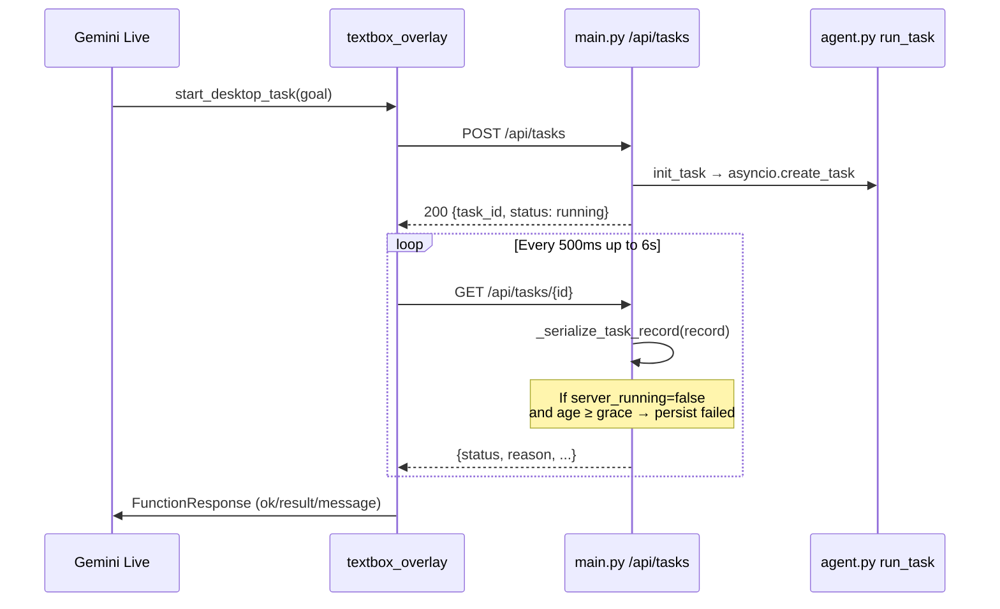

# Proposal: Fix False “Abandoned Task” Failures on Live Spawn

**Doc:** `05-task-spawn-fix.md`  
**Date:** 2026-06-22  
**Scope:** Eliminate bogus terminal failures when Gemini Live spawns a desktop task via `start_desktop_task`  
**Audience:** Engineering (backend task lifecycle owner + Live overlay owner)  
**Related storm workstreams:** `reliability/01-task-abandon-race.md`, `reliability/03-bubble-leak-regression.md`, `reliability/05-spotify-postmortem.md`, `backoffice/04-main-task-lifecycle-review.md`  
**Related Orynn docs:** [00-master-strategy.md §2](../../windows-automation-research/00-master-strategy.md)

> **Ownership boundary:** Backend changes live in `app/main.py` and are owned by the task-spawn agent. This proposal documents the fix spec only — **do not merge overlay-only changes into `main.py` from this doc without coordinating.**

---

## Executive Summary

When Live calls `start_desktop_task`, the overlay POSTs a task and immediately polls `GET /api/tasks/{id}` for up to six seconds (`LIVE_TASK_RESULT_WAIT`). A race in `_serialize_task_record` treated freshly spawned tasks as orphaned when their asyncio coroutine was not yet visible in `service._active_tasks`, or had already exited before the first poll. The serializer then **persisted** a terminal `failed` status with the opaque reason `"Server restarted or task was abandoned."`

Users experienced this as: *“Open Spotify” → “Failed: abandoned” in ~270 ms*, even though Spotify was never attempted and the server had not restarted.

The fix is a **three-layer contract**:

1. **Backend grace + honest reasons** (`main.py`) — hold new tasks as `running` for a short startup window; never emit “abandoned”; surface real coroutine exceptions when available.
2. **Live bubble isolation** (`textbox_overlay.py`) — never flash raw backend failure strings over the conversation; Live speaks outcomes via tool responses and `send_task_update`.
3. **Regression tests** (`tests/test_task_abandon_grace.py`, Live integration tests) — lock the grace window and reason strings.

Most of (1) and all of (2)–(3) are already in the tree. This proposal is the canonical spec for finishing verification and closing remaining design gaps.

---

## 1. Problem Statement

### 1.1 User-visible symptom

| Step | What happens |
|------|----------------|
| 1 | User speaks a desktop goal (e.g. “Open Spotify”) |
| 2 | Gemini Live calls `start_desktop_task` |
| 3 | Overlay POSTs `/api/tasks`, sets `_active_task_running`, enters `_await_task_outcome` |
| 4 | First poll (~0–500 ms) returns `status: failed` |
| 5 | Live tells the user the task failed with “Server restarted or task was abandoned.” |
| 6 | Bubble may flash `Failed: Server restarted…` over the live transcript |

The failure is **synthetic** — inferred by serialization logic, not by the agent loop reporting a real error.

### 1.2 Evidence from persisted tasks

| Task ID | Goal (truncated) | Created → finished | Reason persisted |
|---------|------------------|--------------------|------------------|
| `clicky-c6beede9be` | `TASK: open Spotify` | 2026-06-22 17:57:41.583 → 17:57:41.854 (**~270 ms**) | `Server restarted or task was abandoned.` |
| `trust-running` | `use the desktop` | 2026-06-22 18:08:35.532 → 18:08:35.537 (**~5 ms**) | Same opaque string |

These durations are far below normal agent runtime and correlate with the inline Live wait window, not with UIA/launch work.

### 1.3 Why it breaks trust

- Live’s spoken contract is outcome-based (“I opened Spotify”), not process-based (“I started a backend job”).
- A false failure within hundreds of milliseconds makes the product feel broken before any desktop action occurs.
- The old reason string conflated **three unrelated failures** (real restart, queue wedge, startup race) into one message, blocking diagnosis.

---

## 2. Root Cause Analysis

### 2.1 Spawn → poll timeline



### 2.2 Faulty inference in `_serialize_task_record`

For non-terminal records, the serializer previously did:

```
if not server_running and not paused and not queued:
    → status = failed
    → reason = "Server restarted or task was abandoned."
    → _save_task_record(record)   # side effect on GET
```

**`server_running`** is `_task_is_server_running(task_id)` — true only when `service._active_tasks[task_id]` exists and `not task.done()`.

That flag is false in several distinct situations:

| Situation | Legitimate? | Old behavior |
|-----------|-------------|--------------|
| Poll arrives before coroutine registers | Race (transient) | **False fail** |
| Coroutine crashed during `run_task` init | Real failure | Fail, but opaque reason |
| Task record exists; coroutine never created (bug) | Real failure | Fail, but opaque reason |
| Actual server restart; record reloaded from disk | Real failure | Different message on load path |

The bug is treating the **transient startup window** the same as a **dead task**, and doing so on a **read path** that mutates persistence.

### 2.3 Amplifier: Live inline wait

`LIVE_TASK_RESULT_WAIT` defaults to **6 s** (`ORYNN_LIVE_TASK_WAIT`). The overlay polls aggressively (500 ms cadence). A false terminal status on the **first** poll short-circuits the wait and returns failure to Gemini before the agent emits `task_started` or any tool step.

### 2.4 Amplifier: Bubble leak (fixed separately)

Even when the model received an honest `result`, `_set_label` could still show `"Failed: Server restarted or task was abandoned."` from `task_result` events. Live overlay now mutes `task_result` while Live drives and uses a generic bubble label (`"Couldn't complete that"`) on failure.

---

## 3. Proposed Fix

### 3.1 Layer A — Backend startup grace (`main.py`, **owned by task-spawn agent**)

**Goal:** Never classify a just-created task as failed while it may still be starting.

| Constant | Default | Env override |
|----------|---------|--------------|
| `_TASK_START_GRACE` | `4.0` s | `ORYNN_TASK_START_GRACE` |

**Behavior in `_serialize_task_record` when** `not terminal` **and** `not server_running` **and** `not paused` **and** `not queued`:

1. Compute `age = _record_age_seconds(record)` from `created_at`.
2. If `age < _TASK_START_GRACE`:
   - Return payload with `status: running`, `server_running: true` (**optimistic** for poll clients).
   - **Do not** mutate or persist the record.
3. Else (grace expired):
   - Set `status: failed`.
   - Set `reason` via priority chain:
     1. `_task_done_exception(task_id)` — e.g. `RuntimeError: …` from `task.exception()`
     2. Existing `record.reason` if already set
     3. Fallback: `"the task ended before it could run"`
   - Persist once with `_save_task_record`.

**Hard requirement:** Remove `"Server restarted or task was abandoned."` from all **runtime** serialization paths. That string must never reach Live, the dashboard, or SSE again.

**Legitimate restart path (unchanged intent):** `_load_persisted_tasks` may still mark previously running records as failed with `"Server restarted while task was active."` on process boot. That is a different, accurate scenario and should remain distinct from the spawn race.

#### Helper: `_task_done_exception`

```python
def _task_done_exception(task_id: str) -> Optional[str]:
    task = service._active_tasks.get(task_id)
    if task is None or not task.done():
        return None
    try:
        exc = task.exception()
    except asyncio.CancelledError:
        return "the task was cancelled before it finished"
    except Exception:
        return None
    if exc is not None:
        return f"{type(exc).__name__}: {str(exc)[:160]}"
    return None
```

#### Helper: `_record_age_seconds`

Parse ISO `created_at` ( tolerate naive timestamps as UTC ) and return age in seconds, or `None` on parse failure.

### 3.2 Layer B — Live overlay presentation (`textbox_overlay.py`, **already landed**)

These changes prevent correct backend data from leaking into the bubble as raw errors:

| Location | Change |
|----------|--------|
| `_set_label` | Mute `task_result` and task churn sources while `_live_is_running()` or Live hold active |
| `_await_task_outcome` | On failure, bubble shows `"Couldn't complete that"`; model receives `result`/`message` with the real reason |
| `_capture_live_task_outcome` | Long-running tasks finish via poll/SSE → `send_task_update` speaks outcome |

No further overlay work is **required** for the abandon race once Layer A is verified. Optional follow-up: add a metric counter when `_await_task_outcome` sees `failed` within grace (telemetry only).

### 3.3 Layer C — Tests

#### Unit: `tests/test_task_abandon_grace.py`

| Test | Asserts |
|------|---------|
| `test_fresh_running_task_kept_running_within_grace` | Record age 0.2 s, not in `_active_tasks` → serialized `status == running` |
| `test_stale_running_task_failed_with_human_reason` | Record age `_TASK_START_GRACE + 5`, not in `_active_tasks` → `failed`, reason present, **no** `"abandoned"`, **no** `"Server restarted"` |

Run:

```powershell
cd C:\Users\ACER\Desktop\Ai_computer\Orynn
python -m pytest tests/test_task_abandon_grace.py -q
```

#### Integration (recommended additions)

| Test | Intent |
|------|--------|
| `test_get_task_does_not_false_fail_during_grace` | POST task, GET within 100 ms, still `running` |
| `test_live_start_desktop_task_no_abandon_on_fast_poll` | Fake client returns `running` for 2 s then `done`; Live never sees `abandoned` |
| Golden voice: “Open Spotify” | End-to-end; no failure spoken within 1 s of ack |

Existing `test_live_start_desktop_task_reports_failure_to_model` already verifies honest failure propagation when the backend truly returns `failed`.

---

## 4. Design Notes and Follow-ups

### 4.1 Side effect on GET (medium priority)

`_serialize_task_record` **writes** to disk when inferring failure after grace. A GET handler should ideally be read-only; consider moving inference to:

- explicit watchdog (`_reap_stuck_tasks`), or
- a `POST /api/tasks/{id}/reconcile` internal hook,

so polling cannot permanently terminalize a record. **Out of scope for the hotfix** unless false fails persist after grace in production.

### 4.2 Ordering hardening (low priority)

If races persist under load, ensure `service.init_task` registers `asyncio.create_task` **before** `_save_task_record` returns to the POST caller, and emit `task_started` on the log bus before HTTP 200. Today `init_task` is synchronous and should already register the task; the grace window covers any remaining jitter.

### 4.3 Distinguish “starting” from “running” (future)

An explicit `status: starting` would let poll clients show accurate UI without lying about `server_running`. Not required if grace + tests pass.

### 4.4 Environment tuning

| Variable | Purpose | Suggested range |
|----------|---------|-----------------|
| `ORYNN_TASK_START_GRACE` | Startup hold window | 3–6 s |
| `ORYNN_LIVE_TASK_WAIT` | Inline outcome wait | 4–8 s (must stay < Gemini tool timeout 15 s) |

Grace should exceed worst-case cold-start for `init_task` + first log line under load, but stay below user-perceived “stuck” threshold (~5 s).

---

## 5. Acceptance Criteria

- [ ] Voice “Open Spotify” (or any `start_desktop_task` spawn) does **not** report failure within `_TASK_START_GRACE` unless the agent loop genuinely terminalized.
- [ ] No API response, SSE event, or persisted task JSON written at runtime contains `task was abandoned`.
- [ ] True failures after grace expose a **specific** reason (`TypeError: …`, `"the task ended before it could run"`, etc.).
- [ ] Live bubble never shows raw backend failure strings during an active Live session (regression: `test_live_transcript_suppresses_background_status_flicker`).
- [ ] `pytest tests/test_task_abandon_grace.py` green.
- [ ] Post-fix manual run: new task records for successful opens do **not** finish in <1 s with a synthetic reason.

---

## 6. Rollout Plan

1. **Verify** Layer A constants and helpers in `main.py` match §3.1 (task-spawn agent).
2. **Run** unit + Live test subsets listed in §3.3.
3. **Manual smoke:** single Live session, one spawn command, watch `tasks/clicky-*.json` — `reason` must not be the old opaque string.
4. **Optional cleanup:** stale JSON under `tasks/` with `"Server restarted or task was abandoned."` are historical artifacts; no migration needed.
5. **Monitor:** `textbox_labels.jsonl` for `"Couldn't complete that"` within 1 s of spawn (should trend to zero for simple opens).

---

## 7. Files Touched (reference)

| File | Role | Owner |
|------|------|-------|
| `app/main.py` | `_TASK_START_GRACE`, `_serialize_task_record`, `_task_done_exception`, `_record_age_seconds` | Task-spawn agent |
| `app/widget/textbox_overlay.py` | `_await_task_outcome`, `_set_label` muting, `_capture_live_task_outcome` | Live/overlay |
| `tests/test_task_abandon_grace.py` | Regression tests | Either |
| `tests/test_gemini_live.py` | Bubble leak + Live tool contract tests | Either |

**Do not edit `main.py` from this proposal workstream** — document and review only; implementation PR belongs to the owning agent.

---

## 8. Summary

The “abandoned task” bug was a **serializer race**: Live polled too early, `_serialize_task_record` inferred orphan status, persisted a false failure, and surfaced an opaque reason that conflated restart with startup timing. The fix adds a **startup grace window**, **honest exception plucking**, and **Live-side bubble isolation**, with tests to prevent regression. Backend spec is complete in §3.1; verify, test, and ship via the `main.py` owner.
