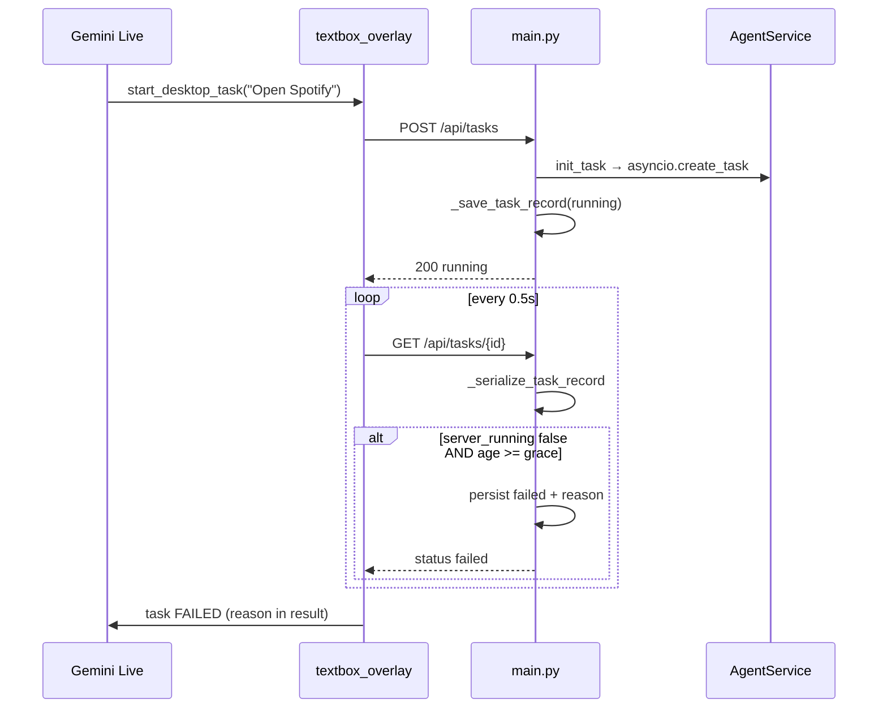

# Task Abandon Race — "Server restarted" False Failures

**Storm workstream:** reliability/01  
**Status:** Draft — analysis + proposed fix (no code)  
**Date:** 2026-06-22  
**Primary sources:** `app/main.py`, `tasks/*.json`, `tests/test_task_abandon_grace.py`, `app/widget/textbox_overlay.py`

---

## 1. Problem

Users (especially via **Gemini Live → `start_desktop_task`**) see tasks fail within **hundreds of milliseconds** with reasons like:

- `Server restarted or task was abandoned.` *(legacy persisted reason)*
- `Server restarted while task was active.` *(startup reload path)*

The UI surfaced this as **`Failed: Server restarted…`** in the Live bubble — the "Open Spotify leak" (~270 ms from start to bogus failure).

This is usually **not** a real server restart. It is a **liveness inference race**: the backend decides a task is dead because `service._active_tasks` does not show a running coroutine **at poll time**, then **persists** that verdict to `tasks/{id}.json`.

---

## 2. Evidence from `tasks/*.json`

### 2.1 Abandon-race fingerprints (sub-second lifetime)

| File | Goal | Created → finished | Reason |
|------|------|-------------------|--------|
| `tasks/clicky-f510fe3d74.json` | Open Spotify | **~273 ms** | `Server restarted or task was abandoned.` |
| `tasks/trust-running.json` | use the desktop | **~5 ms** | `Server restarted or task was abandoned.` |
| `tasks/clicky-245a57ddc2.json`, `clicky-c6beede9be.json` | desktop tasks | sub-second | same legacy reason |

These match the comment in `main.py` (~270 ms "Open Spotify → Failed: abandoned").

### 2.2 Startup-reload fingerprints (longer lifetime, pytest/dev)

| File | Context | Lifetime | Reason |
|------|---------|----------|--------|
| `tasks/session-65d6b243c63c4df489c5607e85f57069.json` | `test goal` | ~1.5 s | `Server restarted while task was active.` |
| `tasks/project-folder-task-a0fa643c.json` | pytest temp `pytest-of-ACER` | ~14.5 s | `Server restarted while task was active.` |
| Many `session-*.json`, `auth-*.json`, `project-folder-task-*.json` | test / session harness | varies | same startup reason |

These come from **`_load_persisted_tasks()`** marking any `running|paused|pending` record as failed on process boot — correct for a real crash, but also fires on **dev hot-reload** and **pytest** killing the server mid-task.

---

## 3. Root cause — two code paths, one symptom

### 3.1 Path A — Poll-time abandon (`_serialize_task_record`)

```608:646:C:\Users\ACER\Desktop\Ai_computer\Orynn\app\main.py
def _serialize_task_record(record: TaskRecord) -> dict:
    ...
    if not terminal:
        if payload["server_running"] or payload["paused"] or is_queued:
            payload["status"] = "paused" if payload["paused"] else ("queued" if is_queued else "running")
        else:
            age = _record_age_seconds(record)
            if age is not None and age < _TASK_START_GRACE:
                payload["status"] = "running"
                payload["server_running"] = True
                return payload
            record.status = "failed"
            record.reason = (
                _task_done_exception(record.id)
                or record.reason
                or "the task ended before it could run"
            )
            ...
            _save_task_record(record)
```

**Failure mode:**

1. `POST /api/tasks` saves `status: running` and registers `asyncio.create_task` in `init_task`.
2. Live immediately polls `GET /api/tasks/{id}` (`_await_task_outcome`, 0.5 s interval, up to 6 s).
3. If `_task_is_server_running()` is false **and** age ≥ `ORYNN_TASK_START_GRACE` (default 4 s), or grace did not exist (legacy), serialize **mutates + persists** `failed`.
4. Poll returns terminal state; Live speaks failure; disk retains bogus reason.

**Anti-pattern:** GET is a **read path with write side effects** — every poll can permanently fail a healthy task.

`_task_is_server_running` only checks `service._active_tasks[task_id]` and `not task.done()` — no log-event or heartbeat signal.

### 3.2 Path B — Startup reload (`_load_persisted_tasks`)

```508:513:C:\Users\ACER\Desktop\Ai_computer\Orynn\app\main.py
        if record.status in {"running", "paused", "pending"}:
            record.status = "failed"
            record.reason = record.reason or "Server restarted while task was active."
            record.finished_at = record.finished_at or datetime.now(timezone.utc).isoformat()
            ...
            _save_task_record(record)
```

Runs once at import (`_tasks = _load_persisted_tasks()`). Any in-flight task on disk becomes failed — expected after crash, noisy during **uvicorn --reload**, pytest, or subagent-storm parallel runs.

### 3.3 Client amplification (`textbox_overlay.py`)

- `_await_task_outcome` polls `GET /api/tasks/{id}` and passes `reason` to Live.
- Legacy bubble leak: `_label_for_event` could show `Failed: {reason}` while Live was driving.
- **Mitigations already shipped:** `_TASK_START_GRACE`, human fallback reason, Live label muting, `_await_task_outcome` uses `"Couldn't complete that"` instead of raw reason.

Legacy string `Server restarted or task was abandoned.` is **gone from `main.py`** but remains in older `tasks/*.json` artifacts.

---

## 4. Race timeline (Open Spotify)



---

## 5. Partial fixes already in tree

| Fix | Location | Gap |
|-----|----------|-----|
| `_TASK_START_GRACE` (4 s) | `main.py:577–628` | Time-based only; poll after grace still abandons |
| `_task_done_exception` | `main.py:590–605` | Only if coroutine ended with exception |
| Human reason fallback | `"the task ended before it could run"` | Better than "abandoned", still opaque |
| `test_task_abandon_grace.py` | unit tests | No HTTP integration; no disk persistence test |
| Live label muting | `textbox_overlay.py:874–883` | UX band-aid; backend still persists false failure |
| Clean fail label | `_await_task_outcome` | Hides symptom, does not fix state |

---

## 6. Proposed fix (implementation plan)

### 6.1 Principle: separate observation from reconciliation

| Concern | Where | Rule |
|---------|-------|------|
| **Observation** (GET/list) | `_serialize_task_record` | **Read-only.** Never call `_save_task_record`. |
| **Reconciliation** | `_queue_watchdog_loop` / dedicated `_reconcile_task_liveness` | Periodically decide if a non-terminal task is truly dead. |
| **Startup** | `_load_persisted_tasks` | Distinguish crash recovery vs dev reload. |

### 6.2 Signal-based liveness (replace age-only grace)

Hold a task as `running` until **any** of:

1. `task_id in service._active_tasks` and `not task.done()`
2. `task_id in _queued_task_specs`
3. `record.paused`
4. Log shows lifecycle progress: `task_started`, `task_created`, first `status`/`action_start`/`provider_info`
5. Within `ORYNN_TASK_START_GRACE` since **last progress event** (not only `created_at`)

Only after **all** signals absent for grace window → reconcile to `failed`.

### 6.3 Move abandon logic to watchdog

Extend `_queue_watchdog_loop` (already runs every `_WATCHDOG_INTERVAL` ≈ 5 s):

```
for each non-terminal record in _tasks:
    if _task_is_genuinely_dead(record):
        record.status = "failed"
        record.reason = _task_done_exception(id) or _infer_failure_from_log(id) or "the task ended before it could run"
        _save_task_record(record)
        emit error/done event if not already emitted
```

`_serialize_task_record` returns **computed** `status`/`server_running` for the response without mutating disk.

### 6.4 Startup reload policy

Options (pick one for subagent-storm / dev):

- **A (conservative prod):** Keep fail-on-load for `running`, but set reason `Task interrupted by server restart` and do not conflate with poll-time abandon.
- **B (dev):** If `ORYNN_RESUME_TASKS=1` or `ORYNN_DEV_RELOAD=1`, leave records `running` and let queue watchdog reconcile — avoids pytest/reload polluting `tasks/`.
- **C (hygiene):** Test tasks write to `tasks/.pytest/` or in-memory store so production `tasks/` is not filled with false restart failures.

### 6.5 Reason string taxonomy

| Situation | Reason | Set by |
|-----------|--------|--------|
| Process boot, task was on disk | `Task interrupted by server restart` | `_load_persisted_tasks` only |
| Coroutine crashed | `{ExceptionType}: {message}` | `_task_done_exception` |
| Log has `error` event | event message | `_infer_task_from_log` |
| No coroutine, no log, past grace | `The task ended before it could run` | watchdog reconcile |
| **Never** | `Server restarted or task was abandoned` | remove entirely |

### 6.6 Client hardening (defense in depth)

1. `_await_task_outcome`: treat `failed` with `server_running: true` in payload as still running (if serialize ever reports both during transition).
2. Do not promote `reason` to spoken failure until `server_running` is false **and** status stable across **two** consecutive polls.
3. Keep Live label muting for `task_result` while Live drives.

### 6.7 Tests to add

| Test | Asserts |
|------|---------|
| `test_get_task_does_not_persist_abandon` | `GET /api/tasks/{id}` within grace does not change `tasks/{id}.json` |
| `test_immediate_poll_after_create` | `POST` then `GET` < 100 ms → `running`, `server_running: true` |
| `test_watchdog_reconciles_zombie` | Pop `_active_tasks`, wait > grace, watchdog → `failed` with human reason |
| `test_load_persisted_marks_restart` | Only on boot, not on GET |
| Regression | `test_task_abandon_grace.py` still passes |

---

## 7. Subagent-storm impact

Parallel subagent runs + uvicorn reload amplify Path B: many `session-*` / `project-folder-task-*` JSON files with `Server restarted while task was active.` are **test harness noise**, not user failures.

Recommended for storm work:

1. Implement **6.1 + 6.3** first (highest ROI, fixes Live false failures).
2. Add **6.4-C** or env-gated resume for dev.
3. One-time cleanup of stale `tasks/*.json` abandon artifacts (optional script).

---

## 8. Acceptance criteria

- [ ] "Open Spotify" via Live does not fail in < 1 s without a real agent error.
- [ ] `GET /api/tasks/{id}` never writes to disk.
- [ ] No persisted reason contains `abandoned` or conflates restart with poll-time inference.
- [ ] Real server restart still marks orphaned tasks failed on boot.
- [ ] `tests/test_task_abandon_grace.py` + new integration tests pass.

---

## 9. Files to touch (when implementing)

| File | Change |
|------|--------|
| `app/main.py` | Split serialize vs reconcile; watchdog; startup policy |
| `tests/test_task_abandon_grace.py` | Extend |
| `tests/test_task_liveness_integration.py` | New |
| `app/widget/textbox_overlay.py` | Optional double-poll stability |
| `docs/subagent-storm/reliability/01-task-abandon-race.md` | This document |

---

**Return path:** `C:\Users\ACER\Desktop\Ai_computer\Orynn\docs\subagent-storm\reliability\01-task-abandon-race.md`
