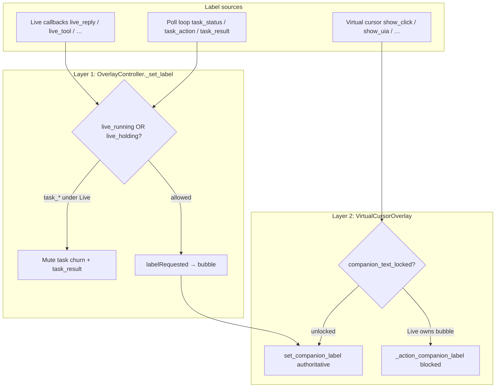

# 03 — Bubble leak regression review

**Scope:** `C:\Users\ACER\Desktop\Ai_computer\Orynn\app\widget\textbox_overlay.py` (+ `virtual_cursor.py`, backend grace in `main.py`)  
**Purpose:** Document what “bubble leaks” were, how they were fixed, and which tests guard against regression.

---

## Summary

The companion bubble is the user-facing “front desk.” Several paths were letting **agent-facing diagnostics**, **task step churn**, and **raw backend failure strings** overwrite Live conversation text. Fixes use a **two-layer gate** (label arbitration + cursor text lock), **humanized Live tool labels**, and **explicit muting of `task_result` while Live drives**. Regression coverage is strong in `tests/test_gemini_live.py`, `tests/test_quiet_companion.py`, `tests/test_voice_and_env.py`, and `tests/test_task_abandon_grace.py`.

---

## What leaked (symptoms)

| Leak class | Example user-visible text | Root cause |
|---|---|---|
| Task churn over Live | `Orynning…`, `Searching…`, `Clicking Text Editor` flashing over `Okay, I'm getting it.` | Poll-loop `task_*` labels reached bubble during Live |
| Raw task failure | `Failed: Server restarted or task was abandoned.` | `task_result` not muted under Live; backend opaque reason |
| UIA / recovery diagnostics | `no UIA control matched… Adaptive recovery plan (uia_no_match, 0.70)…` | Raw tool `output` copied into bubble on Live desktop_control failure |
| Internal validation | `Missing query for type` | Fast-path errors painted before escalation |
| Robotic Live chrome | `Gemini Live listening`, input echo (`Heard: …`) | Status/transcript paths treated bubble like a log |
| False “Started” | `Started: open notepad and type hello` | Goal echoed while Live was narrating |
| Agent chain-of-thought | `STEP 4… PLAN: use uiawait…` | `agent` events mapped to labels |
| Cursor-action text | Step labels from flying cursor during Live | `show_*` overwrote companion text without lock |

---

## Fix architecture



### Layer 1 — `_set_label` arbitration (`textbox_overlay.py`)

**Source sets** (lines 320–338):

- `_LIVE_LABEL_SOURCES`: `live_status`, `live_input`, `live_reply`, `live_tool`, `live_error`, `live_stop`
- `_TASK_CHURN_SOURCES`: `task_status`, `task_prime`, `task_action`, `system_wait`

**Key mute rule** (lines 873–884):

```python
if (source in _TASK_CHURN_SOURCES or source == "task_result") and (
    live_running or live_holding
):
    return False  # muted — reason: task_outcome_under_live
```

`live_holding` = label protect window active **and** protect source ∈ `_LIVE_LABEL_SOURCES`. This fixed the gap where only `live_input`/`live_reply` holds were checked — `live_tool` holds no longer let `task_action` through.

**Also fixed:** `task_result` was previously allowed under Live (comment at line 879: *“Was a leak: task_result was excluded from muting”*).

**Thread safety:** `_label_lock` guards protect-window + dedupe reads/writes (lines 699–702).

**Dedup:** `_LABEL_DEDUP_WINDOW = 4.0` skips identical repaint within 4s (lines 347–350, 912–922).

**Diagnostics:** `ORYNN_LABEL_LOG=1` → `logs/textbox_labels.jsonl` records `shown` / `muted` + reason.

> **Stale comment:** Line 332 still says *“task_result still surfaces in the main bubble”* — behavior now mutes `task_result` while Live runs; it surfaces only when Live is **not** driving.

### Layer 2 — Companion text lock (`virtual_cursor.py`)

`_set_live_owns_bubble(True/False)` (lines 765–774) calls `overlay.set_companion_text_locked()`.

While locked, `show_uia` / `show_click` / etc. still animate spatial feedback but `_action_companion_label` is a no-op (lines 401–407). Authoritative `set_companion_label` (Live narration) still updates text.

Toggled on: Live start (line 1200). Off: Live stop/error/wake-sleep/stop-all (lines 849, 1134, 1162, 1205, 1208, 1342, 1352).

### Humanized Live tool labels

`_live_tool_display_label` (lines 1514–1559): failures never expose raw `output`; map to `Couldn't click {target}`, `Couldn't type into`, etc.

`_await_task_outcome` (lines 2682–2686): failure bubble is `"Couldn't complete that"` — raw `summary` goes to Live via `result`/`message`, not the bubble.

`_live_start_desktop_task` (lines 2502–2509): suppresses `Started: {goal}` when `_live_is_running()`; shows it for PTT/dashboard-only launches.

### Live conversation hygiene

| Path | Behavior |
|---|---|
| `_live_input_transcript` | Buffer for auto-screen; **no** bubble echo of user speech (lines 1248–1251) |
| `_live_status` | `"listening"` → cursor only, no bubble (lines 1221–1225) |
| `_live_output_transcript` | Stream-merge + markdown strip; single growing reply (lines 1313–1330) |
| `_desktop_control_route` | Missing-arg / unknown-action → model `message` only, no bubble (lines 1784–1791, 1871–1873) |
| Type w/o target | Escalates to agent; bubble `"Typing that in"` only if Live **not** running (lines 1812–1816) |

### Poll loop + event mapping

`_poll_loop` (lines 2885–2974): events → `_set_label` (subject to arbitration) or `overlayActionRequested` (cursor path, subject to lock).

`_label_for_event`: `agent` type returns `""` — no CoT in bubble (lines 3128–3133).

`_update_cursor_state_from_event`: while Live runs, task lifecycle does **not** flip cursor state (lines 3009–3014) — cursor analog of text flashing.

### Backend (related)

`tests/test_task_abandon_grace.py`: fresh running tasks stay `running` within grace; stale tasks get human `reason` without `"Server restarted"` / `"abandoned"`.

---

## Regression test matrix

| Test | File | Guards |
|---|---|---|
| `test_failed_desktop_action_label_hides_raw_diagnostics` | `test_gemini_live.py` | UIA/recovery strings never in bubble |
| `test_type_without_target_escalates_quietly` | `test_gemini_live.py` | No `Missing query` in labels |
| `test_started_label_muted_while_live_drives` | `test_gemini_live.py` | No `Started:` under Live |
| `test_started_label_shown_without_live` | `test_gemini_live.py` | `Started:` still shown for non-Live |
| `test_label_log_records_shown_and_muted` | `test_gemini_live.py` | Mute reason `task_outcome_under_live` |
| `test_label_dedupe_skips_identical_repaint` | `test_gemini_live.py` | Dedup window |
| `test_label_dedupe_allows_reshow_after_window` | `test_gemini_live.py` | Time-bounded dedup |
| `test_live_transcript_suppresses_background_status_flicker` | `test_gemini_live.py` | Churn + `task_result` muted under reply hold |
| `test_live_running_mutes_task_action_and_status_churn` | `test_gemini_live.py` | `live_running` alone suffices (no hold required) |
| `test_task_action_muted_while_live_tool_label_is_held` | `test_gemini_live.py` | `live_tool` hold blocks task churn |
| `test_task_labels_resume_after_live_hold_expires` | `test_gemini_live.py` | No stale lockout after hold expires |
| `test_live_spawned_task_does_not_flash_over_the_conversation` | `test_gemini_live.py` | End-to-end user-reported scenario |
| `test_live_owns_cursor_state_while_running` | `test_gemini_live.py` | Cursor state not flipped by spawned task |
| `test_companion_text_lock_blocks_cursor_actions_not_authoritative` | `test_quiet_companion.py` | Lock blocks cursor labels, not Live |
| `test_streaming_updates_do_not_restart_popin` | `test_quiet_companion.py` | Streaming reply doesn’t blink bubble |
| `test_agent_reasoning_is_not_shown_in_bubble` | `test_voice_and_env.py` | `agent` events filtered |
| `test_fresh_running_task_kept_running_within_grace` | `test_task_abandon_grace.py` | No instant false abandon |
| `test_stale_running_task_failed_with_human_reason` | `test_task_abandon_grace.py` | No opaque server-restart string |

**Suggested verification command:**

```bash
cd C:\Users\ACER\Desktop\Ai_computer\Orynn
pytest tests/test_gemini_live.py tests/test_quiet_companion.py tests/test_voice_and_env.py tests/test_task_abandon_grace.py -q -k "bubble or leak or muted or live_spawned or companion_text_lock or agent_reasoning or grace"
```

---

## Residual risks / manual checks

1. **Non-Live mode** — `task_result` with `Failed: {reason}` still surfaces from `_label_for_event` (lines 3138–3144). Intentional for PTT/dashboard; verify reasons stay humanized server-side.
2. **HTTP error on task start** — `_live_start_desktop_task` may show raw HTTP body in `live_error` label (line 2513). Narrow failure path; worth spot-checking.
3. **`action_result` failures** — `_label_for_event` can return raw `message`/`output` when `ok is False` (line 3120). Muted under Live via arbitration, but may still leak in non-Live sessions.
4. **Drawable overlay path** — Skips `_set_label` but relies on `companion_text_locked`; ensure `_set_live_owns_bubble(True)` is always paired with Live session start (covered by integration tests).
5. **Comment drift** — Update line 332 comment to match `task_result` muting behavior.

---

## Manual repro checklist (post-fix expected behavior)

1. Start Gemini Live → ask to open Notepad and type hello.
2. Bubble stays on Live’s spoken reply; no `Orynning…` / `Clicking…` flashes.
3. On failure, bubble shows `Couldn't complete that` (not server-restart string).
4. Flying cursor still animates; spatial feedback visible.
5. Stop Live → start task via PTT → `Started:` and step labels appear again.
6. Optional: `ORYNN_LABEL_LOG=1` → confirm `muted` / `task_outcome_under_live` in `logs/textbox_labels.jsonl`.

---

## Files touched (reference)

| File | Role |
|---|---|
| `Orynn\app\widget\textbox_overlay.py` | Label arbitration, Live hygiene, humanized tool labels |
| `Orynn\app\widget\virtual_cursor.py` | `set_companion_text_locked` |
| `Orynn\tests\test_gemini_live.py` | Primary regression suite |
| `Orynn\tests\test_quiet_companion.py` | Cursor lock + streaming pop-in |
| `Orynn\tests\test_voice_and_env.py` | Agent reasoning filter |
| `Orynn\tests\test_task_abandon_grace.py` | Backend abandon-string leak |

---

**Verdict:** Bubble-leak fixes are coherent, layered, and well-tested. The highest-value regression sentinels are `test_live_spawned_task_does_not_flash_over_the_conversation`, `test_live_running_mutes_task_action_and_status_churn`, and `test_companion_text_lock_blocks_cursor_actions_not_authoritative`.
