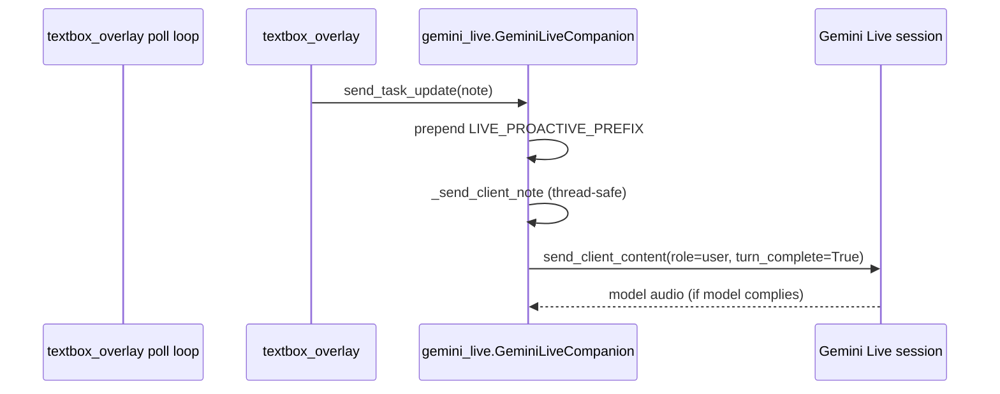

# Proactive Speech Gaps — `send_task_update` in Gemini Live

**Doc:** `04-proactive-speech-gaps.md`  
**Date:** 2026-06-22  
**Scope:** Reliability gaps in Orynn’s proactive spoken task updates via `GeminiLiveCompanion.send_task_update`  
**Primary file:** `C:\Users\ACER\Desktop\Ai_computer\Orynn\app\widget\gemini_live.py`  
**Callers:** `C:\Users\ACER\Desktop\Ai_computer\Orynn\app\widget\textbox_overlay.py`  
**Related tests:** `C:\Users\ACER\Desktop\Ai_computer\Orynn\tests\test_gemini_live.py`

---

## Executive Summary

Proactive speech (“tell the user out loud without being asked”) is implemented as **injected client turns** prefixed with `LIVE_PROACTIVE_PREFIX`, delivered through `send_task_update` → `_send_client_note` → `session.send_client_content(...)`. The transport is **best-effort and silent on failure**. Callers in `textbox_overlay.py` cover three lifecycle moments (task start, mid-task milestones, long-task completion), but several reliability holes mean users can miss spoken updates — especially during reconnects, wake-mode sleep, short inline completions, and long subagent runs with sparse narration.

---

## Architecture



| Layer | Responsibility |
|-------|----------------|
| `LIVE_PROACTIVE_PREFIX` | Instructs model to speak immediately; marks alert as non-user |
| `send_task_update` | Public API; adds prefix unless text already starts with `[ORYNN` |
| `_send_client_note` | Thread-safe bridge to asyncio loop |
| System instruction | Reinforces proactive behavior for `[ORYNN — speak out loud NOW]` messages |
| `textbox_overlay` | **Only** caller — decides *when* to push updates |

### Call sites (overlay → `send_task_update`)

| Method | Trigger | Purpose |
|--------|---------|---------|
| `_notify_live_background_started` | `start_desktop_task` when Live is running | “I’m on it, I’ll report when done” |
| `_maybe_narrate_to_live` | Poll events for Live-launched tasks | Throttled mid-task milestones |
| `_capture_live_task_outcome` | Terminal poll event for Live-launched tasks | Success/failure alert for long background jobs |

---

## Gaps in `gemini_live.py` (transport layer)

### 1. Silent drop when session is not ready

```648:652:C:\Users\ACER\Desktop\Ai_computer\Orynn\app\widget\gemini_live.py
    def _send_client_note(self, text: str) -> None:
        loop = self._loop
        session = self._session
        if loop is None or session is None or self._stop.is_set() or not str(text or "").strip():
            return
```

Updates sent during **first connect**, **reconnect** (`go_away`, network drop), or **after `stop()`** are discarded with no queue, retry, or callback. Reconnect logic clears stale audio but does **not** replay missed proactive alerts.

**Risk:** Background task completes while Live is reconnecting → user never hears the outcome.

---

### 2. Fire-and-forget with swallowed errors

```654:667:C:\Users\ACER\Desktop\Ai_computer\Orynn\app\widget\gemini_live.py
        async def _send() -> None:
            try:
                from google.genai import types
                await session.send_client_content(
                    turns=[types.Content(role="user", parts=[types.Part(text=str(text))])],
                    turn_complete=True,
                )
            except Exception:
                pass

        try:
            asyncio.run_coroutine_threadsafe(_send(), loop)
        except Exception:
            pass
```

- No return value / future exposed to callers  
- No logging, metrics, or `on_error` callback  
- Callers cannot distinguish “delivered” vs “dropped”

**Risk:** WebSocket errors, rate limits, or session state errors fail invisibly.

---

### 3. No outbound queue or ordering

Multiple rapid `send_task_update` calls (start + milestone + completion) schedule independent coroutines with no mutex or queue. Order and coalescing are undefined.

**Risk:** Overlapping `turn_complete=True` injections can confuse the model or cause the latest alert to be partially spoken / interrupted.

---

### 4. Barge-in and turn contention

`_handle_message` flushes speaker output on `interrupted=True`. Proactive alerts use the same realtime channel as user speech and tool turns. There is no guard against injecting an alert while the model is mid-tool-response or while the user is speaking.

**Risk:** Proactive completion message arrives during barge-in → audio cut off; user hears nothing.

---

### 5. No speak-compliance verification

`send_task_update` only **requests** speech via prefix + system instruction. `gemini_live.py` does not verify that `output_transcription` or audio followed the injection.

**Risk:** Model treats alert as context and stays silent — no fallback TTS or retry.

---

### 6. `send_context_update` shares transport without proactive prefix

```644:646:C:\Users\ACER\Desktop\Ai_computer\Orynn\app\widget\gemini_live.py
    def send_context_update(self, text: str) -> None:
        """Alias for memory/knowledge refreshes mid-session (not spoken alerts)."""
        self._send_client_note(text)
```

Vision frames, memory refreshes, and window captures use `send_context_update` (correctly non-spoken). Any future misuse of this API for task alerts would **not** get `LIVE_PROACTIVE_PREFIX` or spoken behavior.

---

## Gaps in caller integration (`textbox_overlay.py`)

These are outside `gemini_live.py` but directly affect whether proactive speech fires.

### 7. Dual completion paths — short vs long tasks

| Path | When | Mechanism |
|------|------|-----------|
| **Inline** | Task finishes within `ORYNN_LIVE_TASK_WAIT` (default 6s) | `_await_task_outcome` → `FunctionResponse.message` tells model to speak |
| **Background** | Task outruns wait window | Poll → `_capture_live_task_outcome` → `send_task_update` |

Inline completion **never** calls `send_task_update`. It relies on the model speaking from the tool result alone.

**Risk:** Model gives a short ack and ignores the failure/success detail in `FunctionResponse` — no second chance via proactive prefix.

---

### 8. Wake-mode idle sleep drops the Live handle

`_maybe_sleep_live` calls `live.stop()` and sets `self._live = None`. `_capture_live_task_outcome` checks `live is not None` but **not** `_live_is_running()`.

When asleep, `live` is `None` → **no completion alert** even though the poll loop still runs and `_last_task_result` is updated.

**Risk:** User starts task via voice, goes idle, Live sleeps, task finishes → silent until they wake Live and ask.

---

### 9. Asymmetric gating: narration vs completion

| Method | Requires `_live_is_running()`? |
|--------|-------------------------------|
| `_maybe_narrate_to_live` | **Yes** |
| `_capture_live_task_outcome` | No (only `live is not None`) |
| `_notify_live_background_started` | Implicit (only called when Live running at start) |

Narration stops when Live stops; completion has the same practical failure (`_live = None`) but inconsistent guards make behavior harder to reason about.

---

### 10. Throttled milestones (default 8s)

`LIVE_NARRATE_INTERVAL = 8.0` (override `ORYNN_LIVE_NARRATE_INTERVAL`; `0` disables).

During long subagent storms, users may hear **nothing for 8+ seconds** between “on it” and the next milestone, even as the cursor pill shows rapid step changes.

**Risk:** Feels unresponsive during multi-minute desktop agent runs; `get_companion_status` is poll-only unless user asks.

---

### 11. Narrow narration filter

`_narration_phrase_for_event` returns `""` for many event types:

- `scroll`, `screenshot`, `get_screenshot` — intentionally silent  
- Most non-`action_start` events — silent  
- `control_profile` — only when app title present  

Subagent recovery loops (many scrolls/screenshots) produce **no proactive speech** between throttled clicks.

---

### 12. `run_workflow` has no background proactive path

`run_workflow` runs steps synchronously in the Live tool handler. It never calls `send_task_update` for start, per-step progress, or completion — only `FunctionResponse.message`.

**Risk:** Multi-step workflows longer than tool timeout (15s) or longer than user attention span get no mid-run proactive updates.

---

### 13. Poll outage can delay or miss terminal events

Poll loop (`_stop.wait(0.45)`) drives `_capture_live_task_outcome`. On repeated poll failures, terminal events are not processed until recovery. `_active_task_running` is intentionally **not** cleared on poll failure.

**Risk:** Completion alert delayed or never spoken if poll is down when task ends and recovery happens after `_live_task_ids` cleanup edge cases.

---

### 14. Only Live-launched tasks are tracked

Proactive updates require `task_id in self._live_task_ids`. Tasks started from dashboard/push-to-talk without Live tracking get **no** `send_task_update` path.

---

## Test coverage gaps

| Covered | Not covered |
|---------|-------------|
| Prefix applied (`test_send_task_update_uses_proactive_prefix`) | `_send_client_note` when `session is None` |
| Background start notification | Reconnect-time alert delivery |
| Narration humanization / throttle / terminal skip | Wake-sleep + background completion |
| `_capture_live_task_outcome` success/failure notes | Model actually speaks after injection (E2E) |
| `complete: false` treated as failure | Concurrent `send_task_update` ordering |
| | Inline `_await_task_outcome` path vs `send_task_update` parity |

---

## Severity matrix

| Gap | User impact | Likelihood | Severity |
|-----|-------------|------------|----------|
| Silent drop on reconnect | Missed completion speech | Medium | **High** |
| Wake-mode sleep + `_live = None` | Missed completion speech | Medium | **High** |
| No delivery acknowledgment | Silent failures | Medium | **High** |
| Inline completion without `send_task_update` | False/missing spoken outcome | Medium | **Medium** |
| 8s narration throttle | Long silent stretches | High | **Medium** |
| Barge-in during alert | Truncated/missed speech | Low–Medium | **Medium** |
| `run_workflow` no proactive path | Silent long workflows | Medium | **Medium** |
| No speak-compliance check | Model stays silent | Low–Medium | **Medium** |

---

## Recommendations (for implementation)

1. **Outbound alert queue in `gemini_live.py`** — buffer `send_task_update` when `session is None`; flush on connect/resume; dedupe/coalesce by kind (start/progress/done).

2. **Return delivery status** — `send_task_update` → `bool` or callback; log failures via existing `_agent_debug_log`.

3. **Unify completion path** — call `send_task_update` from `_await_task_outcome` for terminal inline results too (with dedupe guard vs `_capture_live_task_outcome`).

4. **Wake-mode completion** — keep a stale `GeminiLiveCompanion` ref or queue completion notes; on next wake, flush pending alerts before greeting.

5. **Subagent storm narration** — lower default interval for long runs, or emit proactive updates on `control_profile` / `action_result` failures without waiting for `action_start`.

6. **E2E assertion** — after `send_task_update`, wait for `on_output_transcript` with timeout; retry once if silent.

7. **Tests** — session-none drop, reconnect flush, wake-sleep completion, concurrent updates.

---

## Reference: key constants

| Symbol | Default | Env override |
|--------|---------|--------------|
| `LIVE_PROACTIVE_PREFIX` | `[ORYNN — speak out loud NOW…]` | — |
| `LIVE_NARRATE_INTERVAL` | 8.0s | `ORYNN_LIVE_NARRATE_INTERVAL` (`0` = off) |
| `LIVE_TASK_RESULT_WAIT` | 6.0s | `ORYNN_LIVE_TASK_WAIT` |
| `GEMINI_LIVE_TOOL_TIMEOUT` | 15.0s | — |
| `live_idle_sleep_seconds()` | 60s | `ORYNN_LIVE_IDLE` |

---

## Related docs

- `C:\Users\ACER\Desktop\Ai_computer\Orynn\docs\subagent-storm\tests\01-gemini-live-pytest.txt`
- `C:\Users\ACER\Desktop\Ai_computer\Orynn\docs\subagent-storm\competitors\03-openai-operator.md` (proactive agent UX comparison)

---

*This document is part of the subagent-storm reliability series.*

---

To persist this file, switch to **Agent mode** and ask to write `Orynn\docs\subagent-storm\reliability\04-proactive-speech-gaps.md` with the content above.
