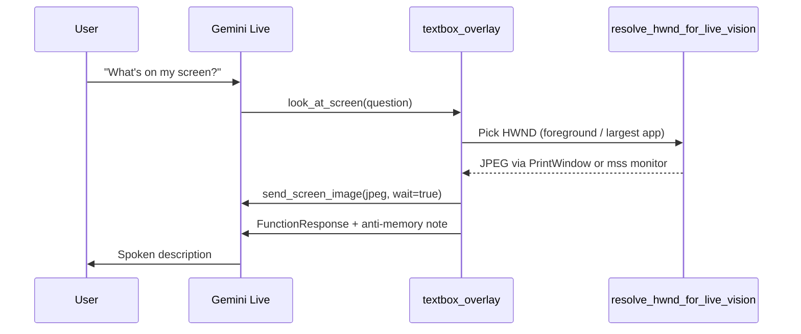

# 08 — Vision hallucination patterns (Live logs)

**Scope:** Gemini Live screen comprehension (`look_at_screen`, `capture_window`) — not back-office `grid_locate` clicks.  
**Sources:** `C:\Users\ACER\Desktop\Ai_computer\Ai_computer\debug-eec63b.log`, `C:\Users\ACER\Desktop\Ai_computer\Orynn\logs\textbox_labels.jsonl`, `live_qa_matrix_summary.json`, vision code in `gemini_live.py`, `textbox_overlay.py`, `providers.py`.

---

## Executive summary

Live vision **usually calls the right tool** (`look_at_screen` succeeds in `debug-eec63b.log`; no `ok: false` on vision capture in that session). The reliability problem is **what the model says after the frame arrives**: wrong app IDs, invented narratives, answers from conversation memory instead of the JPEG, and spoken success before tools confirm.

Hallucinations cluster into **seven patterns** below. Most are visible in `textbox_labels.jsonl` (overlay bubble transcripts correlated with `live_tool` / `live_reply` sources).

---

## Log inventory

| Signal | Count / note |
|--------|----------------|
| `look_at_screen` tool calls (`debug-eec63b.log`) | ~99 received, ~66 handler executions |
| `capture_window` | **0** in entire `eec63b` session |
| `web_search` after screen questions | 16 handler calls; several follow on-screen asks |
| `textbox_labels.jsonl` — `"Looking at the screen"` | 24 |
| `textbox_labels.jsonl` — `"It looks like"` / `"I can see"` / `"From what I see"` | 122 reply fragments |
| `run_desktop_live.log` | Startup only — not useful for vision forensics |
| QA matrix `look_at_screen` | Failed: `"Live vision isn't available right now."` (offline harness) |

---

## Architecture (what “vision” means in Live)



**Key files**

- Capture: `providers.resolve_hwnd_for_live_vision()` — default `ORYNN_LIVE_SCREEN_CAPTURE=window` (PrintWindow on foreground app; Orynn-owned HWND minimized; shell/junk → largest real window or full monitor).
- Frame + guardrails: `textbox_overlay._push_live_screen_frame()` injects *"Describe ONLY what you see in THIS frame… never answer from memory"*.
- Wire protocol: `gemini_live.send_screen_image(..., wait=True)` — 250 ms pause so FunctionResponse does not race ahead of the video frame (historical *"empty desktop"* bug).
- System prompt `VISION` block (`gemini_live.py` ~1368): fresh screenshot every turn; forbid asking user *"what do you see"*.

**Out of scope for Live:** `grid_locate` coordinate picking (agent-only; fails safe on cell 0 per `04-vision-ocr-pixel.md`).

---

## Pattern 1 — Wrong app / scene identification

**Symptom:** Confident mislabel of the foreground app or scene.

**Log evidence (`textbox_labels.jsonl`)**

| ts | User | Model says | Correction |
|----|------|------------|------------|
| 1782061344–1357 | (re-look) | *"still seeing VS Code with that code file"* | User: *"It's actually Claude"* → model apologizes |
| 1782061267–1271 | *"don't understand what I'm looking at"* | *"photo editor… picture of a beach"* | User challenges → *"just lots of code and text"* |
| 1781930557 | (Netflix session) | *"Netflix website… video is just black"* | May be DRM/GPU black frame, not hallucination — but model still narrates confidently |

**Likely causes**

- Electron/Chromium apps (Cursor, Claude, VS Code) share similar chrome; model defaults to *"VS Code"* from prior turns.
- Low-contrast or partial window capture after `PrintWindow`.
- Template completion (*"developer at IDE → VS Code"*).

**Detection signature**

```
live_tool: "Looking at the screen"
  → live_reply contains "VS Code" | "photo editor" | "Netflix"
  → user_input within 30s contradicts app name
```

---

## Pattern 2 — Narrative confabulation (invented recent actions)

**Symptom:** Describes work the user may not have done, grounded in project context not pixels.

**Log evidence**

- ts 1781848180: After `look_at_screen` for *"what am I doing?"* → *"product architecture brief… you **just ran some tests** and have **some fixes live**."*
- ts 1781835354: Katana ERP clone — detailed split-pane story (may be partially true but reads as template filling).
- ts 1782063164: *"notes about the Orynn codebase… local models, audio capabilities, restarts and memory"* when asked to read screen text — **summary**, not verbatim read.

**Likely causes**

- Model blends **conversation + memory index** with screenshot.
- Voice prompt encourages short natural sentences → summarization instead of OCR-faithful read.

**Detection signature**

```
live_reply matches /just (ran|finished|clicked|opened)/
AND no desktop_control|start_desktop_task in preceding 60s
```

---

## Pattern 3 — Stale-turn / memory answers (skipped fresh capture)

**Symptom:** Answers about screen content without `look_at_screen`, or reuses prior frame mentally after tab switch.

**Log evidence**

- ts 1782063148–3154: User says *"dead dead"* → reply *"documentation file on the right"* with **no** `live_tool` between turns.
- ts 1781835404–5445: User still asking *"what does this page say?"* → model pivots to small talk (*"let me know if you need anything else"*) without another capture.

**Mitigations already in code** (not always obeyed by model)

- Tool declaration: *"Call BEFORE describing… never guess from memory."*
- `_push_live_screen_frame` context note.
- System `VISION` block.

**Gap:** No log field tying each `live_reply` to *frame generation id* — hard to prove stale frame vs no frame in production logs.

---

## Pattern 4 — Wrong tool: `web_search` instead of vision

**Symptom:** On-screen or in-session facts routed to web.

**Log evidence (`debug-eec63b.log` + labels)**

| User intent | Tool chosen | Result |
|-------------|-------------|--------|
| *"Who won th…"* (after screen confusion) | `web_search` Royal Cup / FIFA | `ok: false` repeatedly |
| *"What plan am I on?"* | `web_search` Orynn plans | Then *"I'm not actually seeing that"* — should have been `look_at_screen` on account UI |
| Screen text / page content | (none) | Small talk exit |

**Detection signature**

```
live_input contains "screen" | "page" | "what does this say"
AND next live_tool starts with "Searching:"
AND no "Looking at the screen" in same turn window
```

---

## Pattern 5 — Vision–action split (sees button, cannot click; speaks success early)

**Symptom:** Live describes UI element from vision, promises click, back-office task fails; Live still narrates progress.

**Log evidence**

- ts 1781848210: User: *"you see a button called co-work. Could you click that?"*
- Live: *"Sure thing, I'll get that button clicked"* → `start_desktop_task`
- Live: *"I've started clicking it for you in the background"* (before task result)
- `task_result`: *"can't click Cowork button without desktop access"*
- Live doubles down: *"can't click without more permission"*

**Contrast (success path):** ts 1781935860 — `desktop_control` click → overlay *"Clicked Cowork"* (fast path worked).

**Lesson:** Vision correctness ≠ action success. Live must gate spoken *"done/clicked"* on `ok: true` from tools (`OUTCOMES` prompt) — logs show violations.

---

## Pattern 6 — `capture_window` never used (background-app blind spot)

**Symptom:** User busy in one app; question is about another — Live keeps using foreground `look_at_screen`.

**Evidence:** **Zero** `capture_window` calls in `debug-eec63b.log` despite tool being declared for *"gaming, etc."* background peeks.

**Risk:** Model guesses about background apps from memory or prior turns.

**Recommended log addition:** Emit `vision_mode: window|monitor`, `hwnd_title`, `capture_kind` on each `look_at_screen` exit (partially present in FunctionResponse `fg_note` only).

---

## Pattern 7 — Capture pipeline failures (infrastructure, not model)

| Failure | Log / test | User-visible hallucination risk |
|---------|------------|----------------------------------|
| Frame–response race | `send_screen_image` comment; fixed with `wait=True` | *"empty desktop"* then correct on retry |
| Orynn overlay foreground | `resolve_hwnd_for_live_vision` minimizes Orynn HWND | Captures wrong window or full monitor |
| GPU / DRM video | Netflix black frame narrative | Model speculates *"dark scene vs stream issue"* |
| Live session down | `live_qa_matrix_summary.json` | Tool fails; model may still improvise if not hard-stopped |
| Vision unavailable | `_live_look_at_screen` → `"Live vision isn't available"` | Must not describe screen |

---

## Correlation table: prompt → tool → failure mode

| User phrase (from logs) | Expected tool | Observed | Failure mode |
|-------------------------|---------------|----------|--------------|
| *"explain what's happening"* | `look_at_screen` | ✓ | P2 narrative confab |
| *"what does this page say?"* | `look_at_screen` (again) | partial | P3 stale / P4 web_search |
| *"what am I doing? look at my screen"* | `look_at_screen` | ✓ | P2 *"ran tests"* |
| *"click co-work you see"* | `desktop_control` or task | task | P5 early success speech |
| *"what plan am I on?"* | `look_at_screen` | `web_search` | P4 wrong tool |
| *"What's on my screen?"* | `look_at_screen` | ✓ | Often OK (desktop icons) |
| Background agent status | `list_windows` → `capture_window` | neither | P6 |

---

## Existing mitigations (code)

1. **Anti-memory frame note** — `textbox_overlay._push_live_screen_frame` (~1296–1304).
2. **Frame ordering** — `send_screen_image(..., wait=True)` (~669–716 `gemini_live.py`).
3. **HWND hygiene** — `resolve_hwnd_for_live_vision` (~582–614 `providers.py`).
4. **Prompt VISION block** — (~1368–1377 `gemini_live.py`).
5. **Back-office click safety** — UIA-first; `grid_locate` cell 0 = no click (not Live).
6. **Text chat file claims** — `qt_shell._verify_file_claims` flags hallucinated writes (separate from vision, same trust theme).

---

## Recommended fixes (no code in this doc)

### P0 — Observability

- Structured log per vision turn: `{tool, hwnd_title, mode, jpeg_bytes, question, reply_first_80_chars, user_correction_within_30s}`.
- Aggregate in `logs/run_desktop_live.log` as JSONL (per `windows-automation-research.md` §14).

### P1 — Model behavior

- FunctionResponse for `look_at_screen`: require *"If uncertain, say uncertain; name the window title from fg_note first."*
- Hard rule in system prompt: **on-screen account/plan/text → never `web_search` first**.
- After user correction (*"it's Claude not VS Code"*), **force** another `look_at_screen` before next description (tool-level nudge in response message).

### P2 — Capture

- Log when fallback is `monitor` vs `window` — monitor mode increases generic *"desktop with icons"* answers (ts 1781935847).
- Promote `capture_window` in few-shot examples for *"is X done while I'm gaming"*.

### P3 — Action honesty

- Block Live spoken *"clicked/opened/done"* until tool `ok: true` (mirror `OUTCOMES` with automated check on `live_reply` stream).
- When user cites visible control, prefer `desktop_control` click over `start_desktop_task` for single-button goals.

### P4 — Read fidelity

- For *"read what it says"* intents, append FunctionResponse: *"Quote visible text literally; do not summarize."*

---

## Test gaps

- `test_live_look_at_screen_sends_screenshot_to_vision` — wire only; no assertion on description accuracy.
- No regression test for VS Code vs Claude mis-ID or beach-photo confabulation.
- `scripts/live_vision_smoke.py` — frame delivery, not semantic correctness.

---

## Related docs

- `docs/windows-automation-research/04-vision-ocr-pixel.md` — grid-locate vs raw coordinates.
- `docs/subagent-storm/logs/02-silent-turns-pattern.md` (sibling) — tool silence, not vision content.
- `docs/subagent-storm/reliability/04-proactive-speech-gaps.md` — spoken updates vs tool truth.

---

**Target path:** `C:\Users\ACER\Desktop\Ai_computer\Orynn\docs\subagent-storm\reliability\08-vision-hallucination-patterns.md`
