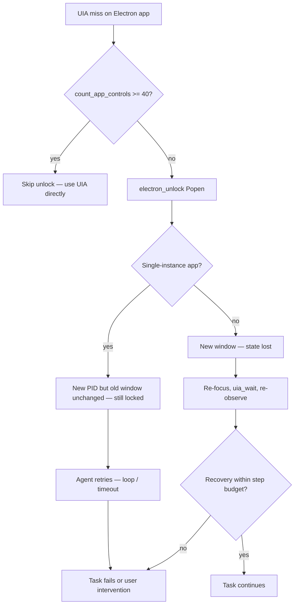

# 09 — `electron_unlock` Disruption During Tasks

**Series:** subagent-storm / reliability  
**Scope:** How Orynn’s Electron accessibility unlock relaunches apps mid-task, why that breaks reliability, and what guardrails exist today.

---

## Summary

`electron_unlock` is Orynn’s recovery path when Chromium/Electron apps hide their DOM from UI Automation. It **spawns a new process** with `--force-renderer-accessibility`. It does **not** terminate the running instance. During an active desktop task this is inherently disruptive: focus shifts, single-instance apps may ignore the new launch, in-app state (unsaved edits, scroll position, navigation) can be lost, and any UIA references the agent held become stale.

Orynn mitigates some of this with a **rich-tree skip** (`count_app_controls >= 40`), **voice consent** before Live escalates into Electron unlock territory, and **dashboard approval** for non-autonomous tasks. Autonomous (voice-spawned) tasks **bypass dashboard approval**, so the voice gate is the only protection against silent relaunch.

---

## What `electron_unlock` Does

### Tool contract

From `C:\Users\ACER\Desktop\Ai_computer\Orynn\app\tool_registry.py`:

> Relaunch an Electron app with `--force-renderer-accessibility` so its DOM becomes a real UIA tree. **Does NOT kill the running copy — the user may need to close it first.**

### Implementation flow

```4168:4222:C:\Users\ACER\Desktop\Ai_computer\Orynn\app\tools.py
    def electron_unlock(self, exe: str, args: list = None):
        ...
        if count_app_controls(app_name, cap=60) >= 40:
            ...  # skip relaunch — already accessible
        res = relaunch_with_accessibility(resolved, args or [], False)
        ...
        return ToolResult(ok=True, output=(
            f"Relaunched {exe} (pid {res.get('pid')}) with --force-renderer-accessibility. "
            f"Its DOM is now exposed to UIA — retry uia_find/uia_click/uia_type. "
            f"{res.get('note','')}"), data=data)
```

Core relaunch (`C:\Users\ACER\Desktop\Ai_computer\Orynn\app\widget\desktop_features.py`):

```1184:1214:C:\Users\ACER\Desktop\Ai_computer\Orynn\app\widget\desktop_features.py
def relaunch_with_accessibility(exe_path: str, ...):
    """Re-launch an Electron app with --force-renderer-accessibility ...
    NOTE: This does NOT kill an already-running instance. The agent should
    propose this to the user and let them close + relaunch themselves."""
    ...
    proc = subprocess.Popen(cmd, close_fds=True)
    return {
        "ok": True,
        "pid": proc.pid,
        "note": ("Existing instance (if any) was NOT terminated — "
                 "Electron apps fight to single-instance themselves; "
                 "if the new window doesn't appear, close the running "
                 "copy first."),
    }
```

### Safety classification

`C:\Users\ACER\Desktop\Ai_computer\Orynn\app\safety.py` marks `electron_unlock` as **high danger**, **requires approval**:

```121:126:C:\Users\ACER\Desktop\Ai_computer\Orynn\app\safety.py
    if t == "electron_unlock":
        return ActionDecision(
            danger=DangerLevel.high,
            reason="relaunches a desktop application with accessibility flags",
            requires_approval=True,
        )
```

---

## Why It Disrupts Tasks

### 1. Process model: spawn, don’t replace

Most Electron apps are **single-instance**. `Popen` with the accessibility flag often produces **no visible new window** if an instance is already running. The agent may report success (new PID) while the user’s session is unchanged and UIA remains locked.

**Task impact:** Agent retries UIA after unlock; tree still empty → retry loops, wasted steps, false “recovery succeeded.”

### 2. User-visible disruption when relaunch works

When the user closes the old instance (or the app accepts a second window):

| Effect | Task impact |
|--------|-------------|
| Window closes/reopens | Breaks multi-step sequences mid-flight |
| Focus stolen | Subsequent `uia_click` may hit wrong window |
| Unsaved state lost | Task goal may become impossible without user intervention |
| Navigation reset | Channel/tab/scroll context from prior steps gone |
| ~10–15s startup | Step timeouts; agent may declare failure or re-plan |

Documented rationale for the skip gate: relaunching an already-accessible app “wasted ~15s” (comment in `tools.py` line 4175).

### 3. Stale UIA graph mid-task

After relaunch, control names, hierarchy, and window handles from earlier observations are invalid. The agent must:

1. `focus_window` / `wait_for_window`
2. `uia_wait` for target controls
3. Re-run `adaptive_observe` or `uia_find`

If the agent continues with pre-unlock control names, reliability drops sharply.

### 4. Autonomous tasks skip dashboard approval

Voice-spawned tasks with `autonomy_level == "autonomous"` add the task to `_approval_bypass_tasks`:

```1732:1742:C:\Users\ACER\Desktop\Ai_computer\Orynn\app\agent.py
        if autonomy_level == "autonomous":
            is_auto_approve = True
            self._approval_bypass_tasks.add(task_id)
            ...
            self.permissions.grant(task_id, "desktop")
```

So **`electron_unlock` can run inside a running autonomous task without a dashboard popup**. Consent is expected to have happened at the Live layer first (see below).

### 5. Competing with a running task (Live path)

Live fast-path clicks check `_busy_response()` before acting, so a model-initiated UIA click does not interleave with an active agent task. Escalation to `start_desktop_task` is serialized — but once the agent runs, unlock is one of its tools.

---

## When Unlock Gets Triggered During Tasks

### Agent system prompt (reactive only)

```2197:2199:C:\Users\ACER\Desktop\Ai_computer\Orynn\app\agent.py
        "- Electron app (Discord/Slack/VS Code/Spotify...) returning no controls → only "
        "when the result says the DOM is locked, electron_unlock with the app NAME, wait "
        "a few seconds, retry. Never preemptively.\n\n"
```

### Adaptive recovery planner

On `FailureClass.electron_accessibility_locked`, first resolver is `electron_unlock`, then `uia_wait` (`C:\Users\ACER\Desktop\Ai_computer\Orynn\app\adaptive_windows.py` ~293–313).

### UIA miss hints

`_electron_unlock_hint` attaches `electron_hint` when UIA and OCR both miss on a known Electron app (`C:\Users\ACER\Desktop\Ai_computer\Orynn\app\tools.py` ~3352–3368).

### Live → agent escalation (Electron-specific consent)

When a fast UIA click fails in a known Electron app, Live **blocks silent escalation** and asks for spoken consent:

```1824:1841:C:\Users\ACER\Desktop\Ai_computer\Orynn\app\widget\textbox_overlay.py
        if self._looks_like_electron(app) and not self._live_bool(args.get("confirmed")):
            ...
            return {
                "ok": False,
                "needs_consent": True,
                "message": (
                    f"I couldn't click that the gentle way in {app or 'that app'}. To do "
                    "it I may have to unlock the app, which can briefly relaunch it (you "
                    "might need to reopen or close it). Ask the user out loud if that's "
                    "okay; only if they clearly say yes, call start_desktop_task with the "
                    "same goal and confirmed set to true. ..."
                ),
            }
```

Known Electron hints: Cursor, Discord, Slack, VS Code, Notion, Obsidian, Spotify, Teams, Figma, WhatsApp, Postman, GitHub Desktop, 1Password, Linear (`LIVE_ELECTRON_APP_HINTS`).

### Goal-level consent for explicit relaunch verbs

`LIVE_CONSENT_RE` treats `relaunch|restart|reboot|...` as disruptive goals requiring spoken yes before spawning a task (`textbox_overlay.py` ~258–277).

---

## Mitigations Already in Code

| Mitigation | Location | Effect |
|------------|----------|--------|
| Rich-tree skip | `count_app_controls >= 40` | Avoids unnecessary relaunch (~15s + disruption) |
| Window-scoped count | `fallback_foreground=False` | Prevents false “already accessible” when app closed |
| Voice consent (Live) | `_desktop_control_route` | No silent unlock escalation for Electron fast-click failures |
| Goal consent | `LIVE_CONSENT_RE` | Blocks autonomous tasks whose goal mentions relaunch/restart |
| Safety approval | `safety.py` | Dashboard gate for non-autonomous / non-bypass tasks |
| Agent discipline | System prompt | “Never preemptively” unlock |
| Telemetry | `used_electron_unlock` in control trace | `main.py` ~2618 |

---

## Failure Modes (Reliability)



1. **Silent no-op unlock** — PID returned, tree still sparse; agent burns steps.  
2. **Unlock after partial progress** — earlier steps’ context invalid.  
3. **Autonomous bypass** — user said “yes” to goal once; agent may unlock without second prompt.  
4. **Wrong app exe** — `resolve_app_exe` mismatch → unlock wrong binary or fail.  
5. **Cursor self-drive** — agent prompt forbids driving Cursor; unlock path still documented for other Electron apps.

---

## Documented Gaps (Not Implemented)

From `C:\Users\ACER\Desktop\Ai_computer\Orynn\docs\windows-automation-research\06-electron-chromium.md`:

1. **No kill-and-relaunch** — `force=true` / `taskkill` + relaunch (user-approved) not in production `electron_unlock`.  
2. **No session `FocusChanged` subscription** — Chromium can expose tree without relaunch when UIA clients listen.  
3. **Flag variant** — newer Chromium may need `--force-renderer-accessibility=complete`.  
4. **CDP path** — `also_remote_debug` exists but default unlock does not use it.

---

## Test Coverage

| Test | File | Asserts |
|------|------|---------|
| Electron click asks consent before unlock | `test_gemini_live.py::test_electron_click_asks_consent_before_unlock` | `needs_consent`, no task spawn |
| Non-Electron escalates without unlock consent | `test_gemini_live.py::test_non_electron_click_escalates_without_unlock_consent` | Direct agent escalation |
| Fast click blocked when task running | `test_gemini_live.py::test_fast_click_blocked_when_a_task_is_running` | Busy gate |
| Electron hint on hard UIA miss | `test_hybrid_resolver.py::test_electron_unlock_hint_on_hard_miss` | `electron_hint` in failure data |
| Autonomous bypasses approval | `test_approval.py::test_autonomous_tasks_bypass_approval` | Normal high-danger actions skip gate |

---

## Recommendations for Subagent-Storm Reliability

**Short term (behavior)**

- After any `electron_unlock`, treat task as **checkpoint reset**: mandatory `focus_window` + `uia_wait` before next action.  
- Surface unlock outcome in task UI: “relaunch spawned” vs “single-instance blocked — close app manually.”  
- Count unlock attempts per task; cap at 1 unless user confirms retry.

**Medium term (product)**

- Implement opt-in **`force` relaunch** with explicit consent copy.  
- Subscribe to **`AutomationFocusChanged`** at session start to reduce relaunch frequency.  
- Extend rich-tree threshold tuning per app (Discord often ≥40 without flag).

**Storm / multi-agent**

- Subagents must not call `electron_unlock` in parallel on the same exe.  
- Parent orchestrator should serialize Electron recovery and pause sibling subagents targeting the same app.

---

## Key File Index

| Path | Role |
|------|------|
| `C:\Users\ACER\Desktop\Ai_computer\Orynn\app\tools.py` | `electron_unlock`, `_electron_unlock_hint` |
| `C:\Users\ACER\Desktop\Ai_computer\Orynn\app\widget\desktop_features.py` | `relaunch_with_accessibility`, `count_app_controls` |
| `C:\Users\ACER\Desktop\Ai_computer\Orynn\app\widget\textbox_overlay.py` | Live consent, Electron hints, escalation |
| `C:\Users\ACER\Desktop\Ai_computer\Orynn\app\agent.py` | Prompt rules, approval bypass |
| `C:\Users\ACER\Desktop\Ai_computer\Orynn\app\safety.py` | Danger / approval |
| `C:\Users\ACER\Desktop\Ai_computer\Orynn\app\adaptive_windows.py` | Recovery plan ordering |
| `C:\Users\ACER\Desktop\Ai_computer\Orynn\docs\windows-automation-research\06-electron-chromium.md` | Deep Electron research |
