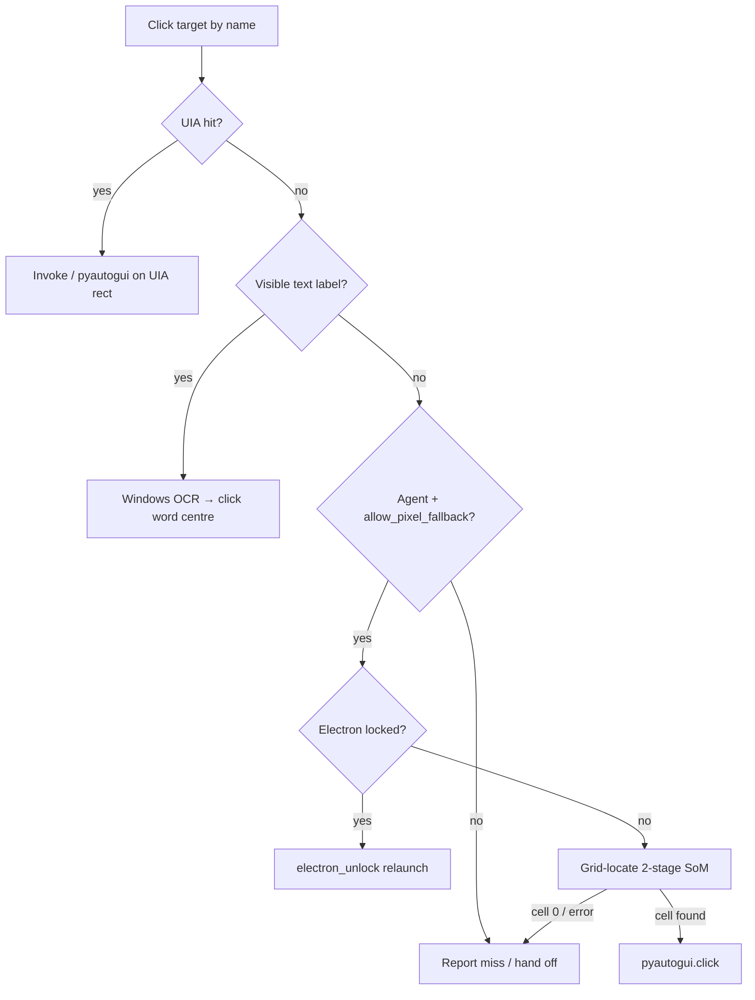

# Non-UIA Visual Automation on Windows

**Date:** 2026-06-22  
**Scope:** Pixel-level control when UI Automation (UIA) is insufficient — OCR, vision models, capture APIs, and input injection.  
**Codebase reviewed:** `app/grid_locate.py`, `app/widget/desktop_features.py`, `app/tools.py`, `app/providers.py`, `app/widget/textbox_overlay.py`, `app/agent.py`  
**Reference implementation:** Clicky `ai/universal_locator.py`, `ai/hybrid_pointer.py`, `ai/element_locator.py`, `screen/capture.py`

---

## Executive Summary

Non-UIA automation is a **fallback ladder**, not a primary control plane. Orynn’s production order is:

1. **UIA** — semantic, fast, free  
2. **Windows Media OCR** — local text locate (~100–500 ms)  
3. **Vision grid-locate (Set-of-Mark)** — 2 Gemini calls, agent-only, fails safe  
4. **Raw screenshot + vision Q&A** — Live reads screens; does not click by coordinates on the fast path  

Pixel clicks (`pyautogui`) and keyboard injection (`SendInput` via `SendKeys` / `pyautogui`) are the **actuators** at the end of every visual path. Capture method choice (`PrintWindow` vs `BitBlt` vs `mss`) determines whether automation sees the right pixels before any locator runs.

---

## 1. Windows OCR (WinRT / winsdk)

### What it is

Windows 10+ ships `Windows.Media.Ocr` — an on-device OCR engine exposed through WinRT. Python access in Orynn uses the **`winsdk`** package (`winsdk.windows.media.ocr`), not Tesseract or cloud APIs.

**Official reference:** [Windows.Media.Ocr namespace](https://learn.microsoft.com/en-us/uwp/api/windows.media.ocr)

### Orynn implementation

| Piece | Location | Behavior |
|-------|----------|----------|
| Engine probe | `ocr_available()` | `OcrEngine.try_create_from_user_profile_languages()` |
| Region OCR | `win_ocr_words()` | `ImageGrab.grab(region)` → BMP → `BitmapDecoder` → `recognize_async()` |
| Text locate | `ocr_find_in_app()` | Fuzzy match query against word/phrase boxes inside app window rect |
| Fallback click | `tools._ocr_click_fallback()` | Called from `uia_click` when UIA misses |

```python
# desktop_features.py — pipeline shape
img = ImageGrab.grab(region).convert("RGB")  # synchronous GDI grab
result = await engine.recognize_async(bmp)   # async WinRT call
# → [{text, x, y, w, h}] in screen coordinates (word centres)
```

### Speed

| Factor | Typical range | Notes |
|--------|---------------|-------|
| Screen grab (`ImageGrab`) | 20–80 ms | GDI `BitBlt` of region; scales with area |
| WinRT `recognize_async` | 80–400 ms | Depends on region size, language pack, CPU |
| **Total per app-window OCR** | **100–500 ms** | One-shot; no API cost |
| Phrase matching | &lt;5 ms | Pure Python over word list |

Orynn runs OCR inside `asyncio.run()` from sync callers — acceptable for fallback tiers but blocks the calling thread. For high-frequency loops, hoist to a background executor.

### Accuracy

**Strengths:**
- Good on standard UI fonts, high-contrast labels, File Explorer, Settings, legacy Win32 dialogs
- Word bounding boxes are usable for click-centre targeting
- Language follows user profile (installed language packs)

**Limits:**
- **Text only** — icons, unlabeled toolbar glyphs, canvas drawings, game HUD art fail
- Small / low-contrast / coloured-on-coloured text degrades
- No semantic structure (button vs static label) — matching heuristics must be conservative
- `ImageGrab` captures **visible desktop pixels**, not occluded or minimized windows
- Requires `winsdk` + language pack; returns `[]` when engine unavailable

### Matching policy (Orynn-specific)

`ocr_find_in_app` deliberately **rejects** bare substring matches (`q in t`) on single tokens to avoid confident wrong clicks (e.g. `"view"` inside `"preview"`). It prefers:
- Exact normalised match (score 100)
- Prefix match (`"Find"` → `"Find..."`, score 82)
- Multi-word phrase alignment on same line (score 74–104)
- Minimum score threshold **44** before returning coordinates

On miss, the agent escalates to grid-locate rather than guessing.

### When to use

| Use OCR | Avoid OCR |
|---------|-----------|
| UIA miss but visible text label exists | Icon-only or canvas UI |
| File Explorer path bar, dialog buttons | Electron before a11y unlock (often no text in tree *or* on screen for custom components) |
| Fast agent fallback before vision | Live voice path when UIA suffices |
| Verifying on-screen copy after action | Reading fine code / logs (use vision Q&A or dedicated OCR crop) |

### vs alternatives

| Engine | Speed | Cost | Notes |
|--------|-------|------|-------|
| **Windows Media OCR** | Medium | Free | Orynn default; OS-integrated |
| RapidOCR / ONNX (Clicky Tier 2) | ~300 ms full screen | Free | Third-party; often better on noisy screenshots |
| Tesseract (Clicky tutor) | Slow | Free | Needs binary install; good for fine print |
| Cloud vision OCR | 200 ms–2 s | $ | Overkill for UI labels |

**Recommendation:** Keep Windows OCR as Orynn’s Tier-2 fallback. Consider RapidOCR only if Windows OCR miss rate is high on target apps.

---

## 2. Screenshot + Vision LLM Coordinate Picking

### Two distinct patterns

#### A. Direct coordinate output (Claude Computer Use)

Anthropic’s **Computer Use** tool returns native `(x, y)` in a declared display resolution. Clicky’s `element_locator.py` resizes to Anthropic-recommended aspect buckets (1024×768, 1280×800, 1366×768), invokes `computer_20251124`, and maps coordinates back through physical → logical DPI space.

- **Accuracy:** ~5 px on 1080p (Clicky docs)
- **Cost:** Full Claude message + tool round-trip per pick
- **Requirement:** `ANTHROPIC_API_KEY`, beta header `computer-use-2025-11-24`
- **Orynn:** Not integrated; Orynn uses Gemini stack

#### B. Set-of-Mark grid (Orynn / Clicky universal locator)

Instead of asking the model for raw pixels, overlay a **numbered grid** and ask: *which cell contains the target?* Reduces hallucinated coordinates; models handle discrete choices better than continuous geometry.

#### C. Screenshot for comprehension only (Orynn Live)

Gemini Live receives JPEG frames via `capture_vision_jpeg` / `send_screen_image` for **answering questions**, not for autonomous coordinate clicking on the voice path. System prompt instructs: use `uia_click` with `app` hint; screenshot + coordinates only after UIA/OCR miss.

### Gemini coordinate picking in Orynn

`grid_locate._ask_cell()` sends grid JPEG + JSON-only prompt to `generate_content` (not Live session):

```text
Reply with ONLY: {"cell": <number>}
If not visible: {"cell": 0}
```

Model chain: `gemini-2.5-flash` → `gemini-2.5-flash-lite` → `gemini-flash-lite-latest` (429 fallthrough). Override via `ORYNN_GRID_MODEL` / `ORYNN_GRID_MODELS`.

**Latency per stage:** ~0.5–2 s (network + inference). Two stages → **1–4 s** typical before click.

**Cost (order of magnitude):** ~2 image+text calls × ~100–300K input tokens equivalent at JPEG 82 quality, 1280 px wide — cents per click at Flash pricing; dominates agent step cost when grid fires.

### Raw coordinate prompting (anti-pattern)

Asking a general vision model *"return x,y of the Save button"* without grid or Computer Use tooling produces:
- Off-by-tens-to-hundreds pixel errors
- Hallucinated elements on dense UIs
- Inconsistent coordinate spaces (model “display” vs physical DPI)

Orynn does **not** use raw coordinate vision for clicks except indirectly via grid cell centres.

---

## 3. Grid-Locate / Set-of-Mark (SoM)

### Algorithm (shared Orynn ↔ Clicky)

Ported from Clicky `ai/universal_locator.py` into Orynn `app/grid_locate.py`:

| Stage | Grid | Cells | Purpose |
|-------|------|-------|---------|
| 1 — coarse | 12 × 8 | 96 | Locate region on full screen |
| Zoom | 3 × 3 cells around pick | — | Crop ~¼ of screen |
| 2 — fine | 6 × 6 | 36 | Sub-cell precision inside crop |

Constants: `ZOOM_RADIUS = 1`, `_MAX_INFER_W = 1280`, upscale crop to ≥768 px wide if small.

**Coordinate mapping:** Cell index → row/col → fractional centre → map through monitor `left/top` from `mss` → absolute screen pixel for `pyautogui.click`.

**Fail-safe contract** (pinned by `tests/test_grid_locate.py`):
- `{"cell": 0}` or parse failure → `None` (no click)
- Missing API key → `None` without calling model
- `ORYNN_GRID_LOCATE=0` → disabled
- Stage-2 miss → centre of stage-1 cell (coarser but still bounded)

### Integration in Orynn

```
uia_click(query, allow_pixel_fallback=True)
  → invoke_ui_element (UIA)
  → _ocr_click_fallback
  → _grid_locate_click
       → focus_window(app)
       → _wait_foreground (poll GetForegroundWindow title, 1.2 s max)
       → grid_locate.locate(query)   # captures PRIMARY monitor via mss
       → pyautogui.click(x, y)
```

**Critical:** `grid_locate.locate()` grabs **primary monitor only** (`mss.monitors[1]`). Multi-monitor targets on secondary displays require future work (Clicky’s `capture.py` tracks per-monitor origins and DPI).

**Policy:** Live fast path sets `allow_pixel_fallback=False` — never grid-locate during voice UX.

### Clicky `hybrid_pointer.py` comparison

Clicky formalises a three-tier resolver:

1. UIA (~5 ms, pixel-perfect)  
2. RapidOCR (~300 ms, text-perfect)  
3. Vision grid (universal_locator / element_locator)

Orynn mirrors the same ladder inside `uia_click` but uses **Windows OCR** instead of RapidOCR and **Gemini grid** instead of provider-agnostic LLM stream.

### Accuracy expectations

| Method | Typical error @ 1080p | Notes |
|--------|----------------------|-------|
| Claude Computer Use | ~5 px | Native coordinate tool |
| Grid-locate (12×8 → 6×6) | **25–50 px** | Clicky/Orynn design target |
| Stage-1 only (if stage-2 fails) | ~80–120 px | Cell-centre fallback |
| OCR text click | Word-box centre | Exact for text, wrong for icons |

Sufficient for buttons, menu items, large icons. Insufficient for dense IDE gutter icons, 1 px splitter drags, or small canvas handles.

---

## 4. pyautogui, SendInput, Mouse/Keyboard Injection

### Mechanism stack

| Layer | API | Orynn usage |
|-------|-----|-------------|
| **SendInput** | `user32.SendInput` | Underlies pyautogui; used by `uiautomation` `SendKeys` |
| **pyautogui** | Cross-platform wrapper | `click_ui_element`, OCR/grid fallbacks, `keyboard_type`, `key_combo`, scroll |
| **UIA InvokePattern** | No injection | Preferred click when pattern available |
| **UIA SendKeys** | Targeted to control | `type_into_ui_element` paste path |
| **PostMessage** | `WM_LBUTTONDOWN` etc. | **Not used** — unreliable for Chromium renderers |

### Why SendInput over PostMessage

Chromium / Electron renderers consume input from the **real input queue**. `PostMessage` to HWND often does not reach the renderer process. Orynn comments in `desktop_features.py` document this; focus + `SendKeys` / `pyautogui` is the reliable path when the target is focused.

### Input politeness

Before mouse/keyboard hijack (`_input_politeness_gate`):
- `wait_for_user_idle()` — `GetLastInputInfo` with synthetic-input discrimination (`note_synthetic_input`)
- Bounded wait (default 1.5 s idle, 8 s max) so agents don’t deadlock on active users

UIA-only actions (find, Invoke on background windows) skip the gate.

### pyautogui caveats

- **FAILSAFE** corner abort (default enabled) — can trigger on multi-monitor layouts
- Global coordinates — must match screen space from UIA rects / OCR / grid (Orynn uses physical screen pixels consistently)
- Rapid `hotkey` can drop/reorder chars — Orynn prefers per-control `SendKeys` for typing
- No elevation / UIAccess — cannot inject into elevated windows from non-elevated agent

### Recommended additions (not yet in Orynn)

- Thin `SendInput` wrapper with scan codes for games that ignore legacy VK paths  
- `RegisterHotKey` emergency stop  
- UIAccess manifest only if cross-elevation is a product requirement  

---

## 5. PrintWindow vs BitBlt vs mss

### Role in pipeline

Capture is **not** interchangeable — each API answers a different question.

| API | What it captures | HWND required | Background / occluded | GPU / DWM composited |
|-----|------------------|---------------|----------------------|----------------------|
| **mss** | Monitor framebuffer | No | N/A (full monitor) | Yes — what user sees |
| **PrintWindow** | Window backing store | Yes | **Often yes** — key for peeking behind overlay | `PW_RENDERFULLCONTENT` (0x2) for layered/DWM |
| **BitBlt** | Visible DC blit | Yes | No — only if unobstructed on screen | Partial — fails when occluded |

### Orynn capture routing

**Live vision** (`resolve_hwnd_for_live_vision` in `providers.py`):
- Default `ORYNN_LIVE_SCREEN_CAPTURE=window` → foreground app HWND → `_capture_hwnd_image`  
- Shell/junk/Orynn-owned HWND → pick largest real app window or fall back to monitor  
- `monitor` / `desktop` env → `mss` primary/full desktop  

**`_capture_hwnd_image` fallback chain:**
1. `PrintWindow(hwnd, hdc, PW_RENDERFULLCONTENT)` — 5 s timeout  
2. `PrintWindow(hwnd, hdc, 0)`  
3. `BitBlt` from window DC  

**Grid-locate:** always `mss.grab(primary_monitor)` — sees desktop as user sees it, including if target window is foreground after `_wait_foreground`.

**OCR:** `ImageGrab.grab(region)` — GDI desktop blit of rectangular region (similar visibility rules to BitBlt).

### When to use which

| Scenario | Choose |
|----------|--------|
| Live peek at app while Orynn overlay visible | **PrintWindow** on target HWND |
| Full-desktop grid locate after focusing app | **mss** monitor grab |
| OCR of app window client area | **ImageGrab** on `app_window_rect` |
| Minimized window | None work reliably — restore first |
| Game / DirectX exclusive fullscreen | Often black/ stale — vision unreliable |
| Multi-monitor app on display 2 | mss with correct monitor index (gap in grid_locate today) |

### Performance

| Method | Typical latency (1080p) | GDI handle pressure |
|--------|-------------------------|---------------------|
| mss | 15–40 ms | Low |
| PrintWindow | 50–200 ms | Medium — Orynn explicitly frees bitmap DCs to avoid pool exhaustion |
| BitBlt | 30–100 ms | Medium |
| ImageGrab region | 20–80 ms | Low |

Orynn caps Live JPEG dimensions via `_pick_capture_cap` (1024×768, 1280×800, 1366×768 buckets) to limit Gemini token bandwidth.

### Failure modes

- **Black frame:** GPU surface not composited to GDI — try `PW_RENDERFULLCONTENT`, else vision path unusable  
- **Stale frame:** Window animating — `_wait_foreground` + 180 ms settle helps grid-locate  
- **Wrong window:** Foreground race — `_wait_foreground` polls title before mss grab  
- **DPI mismatch:** Clicky tracks `dpi_scale`; Orynn grid uses mss physical pixels — generally OK on primary monitor at 100% scale; mixed-DPI multi-monitor is a risk  

---

## 6. Claude Computer Use vs Grid vs OCR

### Comparison matrix

| Dimension | Windows OCR | Grid-locate (SoM) | Claude Computer Use | Raw vision (x,y prompt) |
|-----------|-------------|-------------------|----------------------|-------------------------|
| **Latency** | 0.1–0.5 s | 1–4 s | 1–3 s | 1–3 s |
| **Cost** | Free | Low ($, Gemini Flash) | Medium–high ($, Sonnet) | Low–medium |
| **Accuracy (clicks)** | Text only, high | ~25–50 px | ~5 px | Poor |
| **Icon / canvas** | No | Yes | Yes | Unreliable |
| **Offline** | Yes | No | No | No |
| **Vendor lock-in** | Microsoft | Google (configurable) | Anthropic | Any |
| **Fail-safe** | No match → escalate | cell 0 → no click | Tool error | Hallucination risk |
| **Orynn status** | Production | Production (agent) | Not integrated | Deliberately avoided |

### Decision flowchart



### When Claude CU would win

- Dense UIs where 25–50 px error misses small targets  
- Product already on Anthropic stack with Computer Use beta access  
- Pointer UX where sub-10 px matters (drawing apps, precise sliders)  

### When Orynn’s stack wins

- **Cost at scale:** hundreds of apps × OCR-first avoids vision $  
- **Latency on Live path:** voice cannot wait 2+ model calls  
- **Gemini-native:** single vendor for Live + grid fallback  
- **Fail-safe:** grid returns `None` rather than mis-clicking — critical for shared PCs  

---

## 7. Failure Modes, Cost & Latency Tradeoffs

### Failure modes by layer

| Layer | Symptom | Mitigation in Orynn |
|-------|---------|---------------------|
| UIA | Sparse tree (Electron) | `electron_unlock`, adaptive hint |
| OCR | Wrong substring click | Strict scoring; no bare `in` match |
| OCR | No text on control | Escalate to grid |
| Grid | Target on wrong monitor | **Gap:** primary-only mss |
| Grid | Model picks adjacent cell | Two-stage zoom; accept ~40 px |
| Grid | 429 rate limit | Model fallthrough chain |
| Grid | Foreground race | `_wait_foreground` |
| Capture | Black / stale window | PrintWindow flags; settle delay |
| Input | User fighting agent | Input politeness gate |
| Input | Elevated target | Run agent elevated or use UIA-only |

### End-to-end latency budget (single click miss path)

| Step | UIA only | + OCR | + Grid |
|------|----------|-------|--------|
| Focus window | 50–200 ms | 50–200 ms | 50–200 ms |
| Locator | 50–500 ms | +100–500 ms | +1–4 s |
| Click inject | 5–20 ms | 5–20 ms | 5–20 ms |
| **Typical total** | **0.1–0.7 s** | **0.2–1.2 s** | **1.5–5 s** |

### Cost budget (per 1000 failed UIA clicks)

| Resolver | API $ | Infra |
|----------|-------|-------|
| OCR | $0 | CPU only |
| Grid (2× Flash) | ~$0.50–5 | Depends on image size / quota |
| Claude CU | ~$5–30 | Higher per-call |

At scale (hundreds of apps), **lazy playbooks** (`adaptive_windows_profiles.json` recording `ocr_text_target` vs `vision_grid_locate`) amortise discovery cost — second interaction on same app should hit the winning tier immediately.

### Operational recommendations

1. **Never promote grid to Live** — voice UX target &lt;1 s perceived delay.  
2. **Run OCR before grid** — 10× cheaper, often sufficient.  
3. **Use PrintWindow for Live peek**, mss for full-screen agent locate.  
4. **Log resolver tier** — overlay `control_layer` already tags `vision grid-locate` vs UIA.  
5. **Multi-monitor:** extend `grid_locate` with Clicky-style `physical_left/top` + monitor pick.  
6. **Consider RapidOCR** only after measuring Windows OCR miss rate on top-20 apps.  

---

## 8. Orynn Code Map

| Concern | File | Entry points |
|---------|------|--------------|
| Grid SoM | `app/grid_locate.py` | `locate(target) → (x,y) \| None` |
| OCR | `app/widget/desktop_features.py` | `win_ocr_words`, `ocr_find_in_app`, `ocr_available` |
| Resolver ladder | `app/tools.py` | `uia_click`, `_ocr_click_fallback`, `_grid_locate_click` |
| HWND capture | `app/providers.py` | `_capture_hwnd_image`, `resolve_hwnd_for_live_vision` |
| Live JPEG | `app/widget/textbox_overlay.py` | `_capture_vision_jpeg`, `_capture_window_jpeg` |
| Input gate | `app/widget/desktop_features.py` | `wait_for_user_idle`, `note_synthetic_input` |
| Tests | `tests/test_grid_locate.py` | Coordinate math, fail-safe |
| Env flags | — | `ORYNN_GRID_LOCATE`, `ORYNN_GRID_MODEL(S)`, `ORYNN_LIVE_SCREEN_CAPTURE`, `ORYNN_INPUT_POLITE` |

---

## References

- [Windows.Media.Ocr](https://learn.microsoft.com/en-us/uwp/api/windows.media.ocr)
- [PrintWindow function](https://learn.microsoft.com/en-us/windows/win32/api/winuser/nf-winuser-printwindow)
- [SendInput function](https://learn.microsoft.com/en-us/windows/win32/api/winuser/nf-winuser-sendinput)
- [Chromium accessibility overview](https://chromium.googlesource.com/chromium/src/+/HEAD/docs/accessibility/overview.md)
- Clicky `ai/universal_locator.py` — original SoM grid locator (MIT)
- Clicky `ai/element_locator.py` — Claude Computer Use integration
- Orynn `docs/windows-automation-research.md` — parent research index
